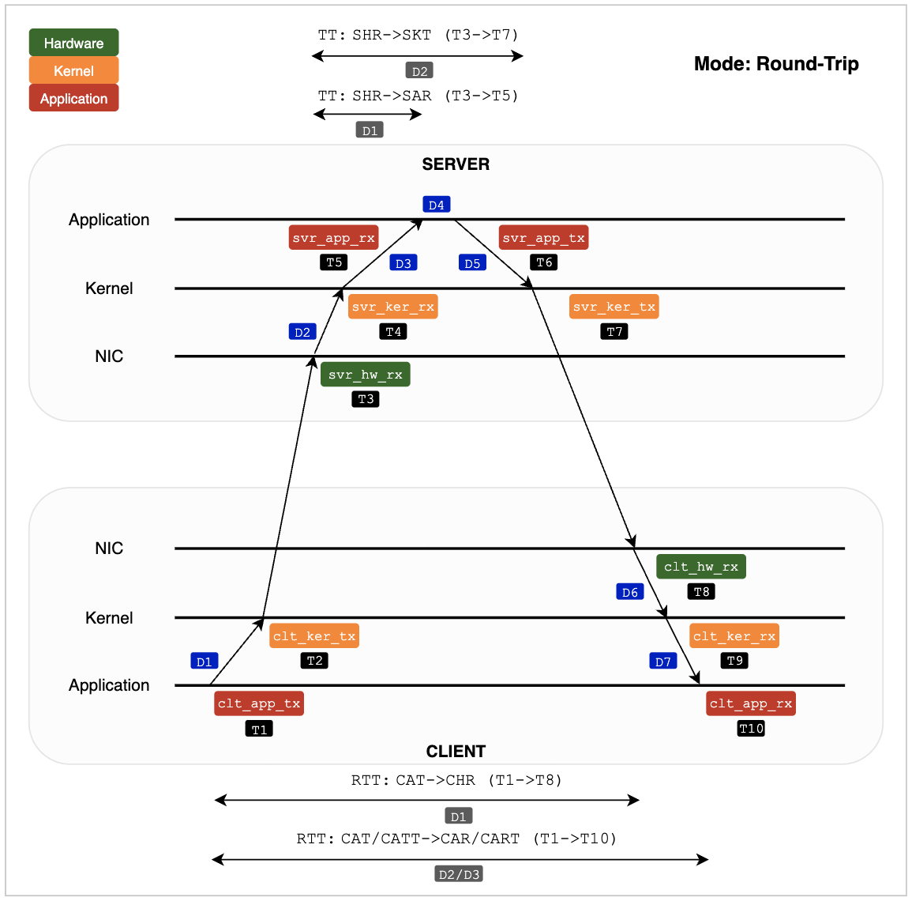

# EC2 Timestamping Client-Server Programs

## Purpose

This project provides UDP client and server programs (`timestamp_client.c` and `timestamp_server.c`) designed to demonstrate and measure network latency using hardware and software timestamps on EC2 instances backed by the Amazon TimeSync service and PTP Hardware Clock (PHC). The Amazon TimeSync service leverages the deployment of a dedicated Data Center (DC) network infrastructure that provides a highly accurate timing signal sourced from global navigation satellite system (GNSS) receivers and delivered to supported EC2 instance types.

These programs can be used for multiple purposes:

- **Hardware RX Timestamp Extraction**: Demonstrates how customers can extract hardware RX timestamps using standard kernel structures and `SO_TIMESTAMPING` APIs, providing simple baseline code that shows hardware RX timestamping capabilities in action. EC2 hardware timestamping is built on the AWS Nitro System and adds a 64-bit nanosecond-resolution timestamp to every inbound network packet.

- **Enhanced Network Measurements**: Show how better One-Way Delay and Round-Trip measurements can be measured using hardware RX timestamps, providing more accurate network performance characterization compared to software-only approaches.

- **Linux Kernel and OS Tuning Validation**: Illustrate how our [Linux kernel and OS tuning playbook](https://github.com/aws-samples/trading-latency-benchmark/blob/main/deployment/ansible/tune_os.yaml) recommendations improve application, kernel and network latency, using the PHC to measure and quantify these improvements with better accuracy and precision. By generating and capturing timestamps at the hardware and software level customers can accurately compare latency across a packet path and between hops, across hardware, kernel, socket and application layers.

- **Network Performance Testing**: Provides a reasonably optimized packet transmit/receive testing tool that allows customers to capture timestamp measurement performance at different PPS rates across various EC2 instance configurations, helping identify where performance contention is introduced.  

- **TSC vs PHC Comparison**: Includes functionality for same-host round-trip timestamp comparisons between the common TSC (Time Stamp Counter) approach versus the system clock using reference time from the PHC, providing timestamp data on the practical differences between these timing sources.

The programs implement standard network hot path optimizations including CPU affinity management, real-time scheduling, batch packet processing and memory-aligned allocations to ensure reliable performance measurements while maintaining simplicity for educational purposes. Additional techniques demonstrated include lock-free data structures and ring buffers for inter-thread communication, zero-copy networking with `sendmmsg()`/`recvmsg()`, TSC-based precise timing control, socket buffer tuning and dedicated processing threads for different operations. These represent typical baseline optimization approaches as examples that customers can adapt and build upon for their own high-performance networking applications, providing an introduction for understanding both the measurement capabilities and the performance techniques commonly used in latency-sensitive network programming.

**NOTE**: These programs do not, currently, implement any kernel fast-path or bypass techniques. Also, they only reference the value of the 64-bit timestamps created at hardware or kernel timestamping locations and do not factor in their respective clock error bound (CEB). The kernel and hardware layer timestamps do not yet expose interfaces to associate the CEB value with every timestamp. Without the CEB, care must be taken if comparing timestamps created at different layers (hardware, kernel or userspace) and/or collected on different hosts. More information on calculating the CEB and using bounded timestamps is available [here on GitHub](https://github.com/aws/clock-bound).

## Table of Contents

- [Purpose](#purpose)
- [Project Structure](#project-structure)
- [Functional Description](#functional-description)
  - [Captured/generated timestamps](#capturedgenerated-timestamps)
  - [Client and server operational modes](#client-and-server-operational-modes)
  - [Hardware RX timestamp extraction](#hardware-rx-timestamp-extraction)
  - [Timestamp delta and trip time calculations](#timestamp-delta-and-trip-time-calculations)
  - [TX and RX hot paths](#tx-and-rx-hot-paths)
  - [Statistics output](#statistics-output)
  - [CSV logging](#csv-logging)
  - [Kernel TX timestamp processing](#kernel-tx-timestamp-processing)
  - [Joining CSV timestamp files](#joining-csv-timestamp-files)
- [Installation](#installation)
  - [Prerequisites](#prerequisites)
  - [Building](#building)
- [Usage](#usage)
  - [Example usage for client and server](#example-usage-for-client-and-server)
  - [Example usage for CSV join utility](#example-usage-for-csv-join-utility)
  - [Usage help for all command flags](#usage-help-for-all-command-flags)
- [License](#license)

## Project Structure
```
ec2_timestamping_programs/
├── LICENSE                              # MIT-0 license file
├── README.md                            # Project documentation
├── Makefile                             # Build configuration
├── build/                               # Build output directory
├── docs/                                # Documentation assets
│   └── images/
│       ├── one_way_mode_diagram.png     # One-way mode operational diagram
│       └── round_trip_mode_diagram.png  # Round-trip mode operational diagram
├── include/                             # Header files
│   ├── timestamp_common.h               # Core data structures and function declarations
│   └── timestamp_logging.h              # Logging system definitions
├── src/                                 # Source code
│   ├── timestamp_client.c               # UDP client implementation
│   ├── timestamp_server.c               # UDP server implementation
│   ├── timestamp_csvjoin.c              # CSV file joining utility
│   ├── timestamp_common.c               # Shared functionality and optimizations
│   └── timestamp_logging.c              # Logging system implementation
```

## Functional Description
### Captured/generated timestamps
Timestamps are captured or generated by the client/server programs at three layers in the packet path:

- **Hardware (currently RX only)**: Generated by the Nitro hardware packet timestamping clock, whose hardware is designed for nanosecond clock resolution and accuracy. The clock error bound of the Nitro packet timestamping clock is not exposed today. Under normal operation, the expectation (as of Aug 2025) is for these timestamps to be +/- 15us away from UTC time. Although the exact clock error bound cannot be exposed today. This provides a level of timestamp accuracy not possible with software timestamping alone.
- **Kernel (TX and RX)**: Generated by the ENA driver using the system clock (`clock_gettime(CLOCK_REALTIME`). If the EC2 instance has been configured to use the PHC (see prerequisites section below), the system clock obtains its reference time from the Nitro timestamping engine clock. Here the actual clock error bound value can be retrieved periodically if using `chronyd` (synchronization daemon) and the `clockbound` daemon (visit [GitHub link here](https://github.com/aws/clock-bound)). One would typically observe a clock error bound in the order of +/- 30us on average, due to synchronization delays between the Nitro time system and the guest OS time daemon (`chronyd` is recommended).
- **Application (TX and RX)**: Generated by client/server application code using the system clock (`clock_gettime(CLOCK_REALTIME`), also backed by the PHC. The same clock error bound of +/- 30us on average is expected and the recommendation is to use `chronyd` and `clockbound` to obtain exact measurements.

**NOTE**: Clock error bound (CEB) is an important concept when comparing timestamps and reasoning about the accuracy of timestamps generated on different EC2 instances (e.g. between client and server). Capturing hardware RX timestamps now allows for more precise latency measurement between EC2 instances. However, comparing the kernel software TX timestamp from a source instance, with the hardware RX timestamp on a destination instance, can lead to inconsistent results. To identify such cases the CEB of each timestamp should be taken into consideration when making conclusions about the actual network one-way delay (OWD). When the CEB is not available, care should be taken to choose an arbitrary, but pessimistic, value to discard inconsistent scenarios. CEB is a calculation that involves multiple inputs, including delay and dispersion information from the guest OS time daemon and error bound values from the PHC device itself. For a full explanation and approach to measuring this, review this [AWS Blog post](https://aws.amazon.com/blogs/compute/its-about-time-microsecond-accurate-clocks-on-amazon-ec2-instances/) or the [open source clockbound daemon](https://github.com/aws/clock-bound) for finding the CEB in the application layer.

### Client and server operational modes
The core functionality of the client and server programs is to create UDP packets, transmit/receive them and to generate or capture the timestamps for each packet along the transmit/receive paths. The timestamp data is used to generate latency delta statistics for each hop as well as deltas related to trip-time (server) and round-trip (client). The programs can work in one of two modes: `--one-way` or `--round-trip`. The following diagrams illustrate the packet paths, the type of timestamps captured and the deltas generated for each mode.

***One-Way mode***


***Round-Trip mode***


### Hardware RX timestamp extraction
The client and server programs extract hardware receive (RX) timestamps using the standard Linux `setsockopt()` socket API with the `SO_TIMESTAMPING_NEW` option. Hardware RX timestamping is enabled on the network interface specified by the `-rx-interface` flag, using the `SIOCSHWTSTAMP` `ioctl` command. When processing received packets, the `recvmsg()` system call is used to access control messages (ancillary data) returned by the kernel along with the packet payload. The `scm_timestamping64` data structure is embedded in the control messages returned by the kernel and contains an array of three elements that store 64-bit timestamp values:

```
struct scm_timestamping64 {
    struct __kernel_timespec ts[3];
};
```

The `__kernel_timespec` array contains the following elements and 64-bit integer struct members:

```
ts[0] = Software timestamp
ts[1] = Deprecated/unused  
ts[2] = Hardware timestamp

ts[n].tv_sec. = Number of seconds since the Unix epoch
ts[n].tv_nsec = Nanosecond portion of the timestamp
```

The timestamp format extracted is `1234567891.123456789` and this time specification format is used for all packet timestamps generated and extracted by the client and server. If CSV logging is enabled, these are stored in this format in the respective CSV log files. Further information on the Linux kernel interfaces for timestamping operations is available in the [kernel documentation](https://docs.kernel.org/networking/timestamping.html).

### Timestamp delta and trip time calculations
If the `--stats` flag is specified, the client and server programs will output statistics to the console that include the delta and trip time percentiles for the deltas illustrated in the images above. If the `--csv-output` flag is specified, timestamp values for each packet hop, illustrated in the images above, are logged to CSV files and deltas can be calculated post-process using `timestamp_csvjoin` (explained more below).

Console output includes an explanation key for each of the deltas and trip times, explaining the specific hops being computed. These are also included below for reference. These deltas and trip times provide a number of insights:
- Identify single-hop latency contention/performance between application, kernel and network layers
- Demonstrate how hardware RX timestamps can be used to provide additional visibility on packet arrival vs processing
- Display trip and round-trip latencies to show overall packet processing and network costs
- Provide a comparison between single-host timing accuracy using TSC vs PHC

One-Way mode:
| Client/Server | Delta Name | Delta Acronyms | Delta Description |
|-|-|-|-|
|Client| D1 | `CAT (T1) -> CKT (T2)` | Client Application TX -> Client Kernel TX |
|Server| D2 | `SHR (T3) -> SKR (T4)` | Server Hardware RX -> Server Kernel RX |
|Server| D3 | `SKR (T4) -> SAR (T5)` | Server Kernel RX -> Server Application RX |
|Server| TT D1 | `SHR (T3) -> SAR (T5)` | Server Hardware RX -> Server Application RX |

Round-Trip mode:

| Client/Server | Delta Name | Delta Acronyms | Delta Description |
|-|-|-|-|
|Client| D1 | `CAT (T1) -> CKT (T2)` | Client Application TX -> Client Kernel TX |
|Server| D2 | `SHR (T3) -> SKR (T4)` | Server Hardware RX -> Server Kernel RX |
|Server| D3 | `SKR (T4) -> SAR (T5)` | Server Kernel RX -> Server Application RX |
|Server| D4 | `SAR (T5) -> SAT (T6)` | Server Application RX -> Server Application TX |
|Server| D5 | `SAT (T6) -> SKT (T7)` | Server Application TX -> Server Kernel TX |
|Client| D6 | `CHR (T8) -> CKR (T9)` | Client Hardware RX -> Client Kernel RX |
|Client| D7 | `CKR (T9) -> CAR (T10)` | Client Kernel RX -> Client Application RX |
|Server| TT D1 | `SHR (T3) -> SAR (T5)` | Server Hardware RX -> Server Application RX |
|Server| TT D2 | `SHR (T3) -> SKT (T7)` | Server Hardware RX -> Server Kernel TX |
|Client| RTT D1 | `CAT (T1) -> CHR (T8)` | Client Application TX -> Client Hardware RX |
|Client| RTT D2 | `CAT (T1) -> CAR (T10)` | Client Application TX -> Client Application RX |
|Client| RTT D3 | `CATT (T1) -> CART (T10)` | Client Application TX TSC -> Client Application RX TSC |

The `timestamp_csvjoin` program can be used to join client and server CSV timestamp log files, generated in either `--one-way` or `--round-trip` modes. Additional deltas `delta_net_clt_ker_tx_to_svr_hw_rx_us` and `delta_net_svr_ker_tx_to_clt_hw_rx_us` are calculated and written to the joined output file, along with the timestamp values themselves and the deltas above.

### TX and RX hot paths
The client and server programs implement optimized TX and RX hot paths using UDP packets with 4-8 byte payloads containing sequence numbers and client port information for correlation and return routing - packet sizes can be increased and will be padded using the `--pkt-size` flag. They use dedicated CPU core assignments (configurable via `--tx-cpu` and `--rx-cpu` flags, defaulting to TX=4/RX=5) to minimize cross-core contention and cache misses. At higher packet rates it is recommended to specify dedicated CPU cores for TX and RX operations and ideally locate these cores with IRQs servicing the ENIs used. From a NUMA node perspective, ring buffers and associated memory structures are allocated by the thread performing the primary function of the program - TX processing for the client and RX processing for the server. It is therefore recommended to run the client program on a CPU in the same NUMA node as specified by the `--tx-cpu` flag and the server program as specified by the `--rx-cpu` flag. In round-trip mode, the CPUs specified by the `--rx-cpu` (client) and `--tx-cpu` (server) flags should also be located on this same NUMA node. 

Both programs employ consistent performance optimizations including real-time FIFO scheduling (priority 99), memory locking to prevent swapping, 16MB socket buffers, busy polling with 50μs intervals, 64-byte aligned memory allocations to ensure optimal cache line utilization, kernel zero-copy transmission for TX sockets and batch TX processing using `sendmmsg()`. For RX processing `recvmsg()` is used instead of `recvmmsg()` in the RX hot paths to prioritize the measurement of per-packet timestamps over driving very high throughput. This minimizes per-packet latency variance (that can sometimes be introduced by batch processing) and focuses on the main function of these programs.

Packet correlation is achieved through the use of multiple ring buffers that store packet timestamp data indexed by sequence number modulo the array size. Correlation arrays are needed to correlate asynchronous kernel TX timestamps with application timestamps and to tie together all timestamp measurements (application TX/RX, kernel TX/RX, hardware RX) for the same logical packet across different processing stages and threads to enable comprehensive latency analysis, statistics calculation and complete CSV record generation using sequence numbers as the correlation key.

The hot path processing utilizes TSC-based precise timing control with calibrated CPU frequency measurements and hybrid time checking mechanisms that balance timing accuracy with minimal performance impact. Operations like CSV logging and statistics collection are offloaded to dedicated background threads outside primary TX/RX loops.

**NOTE**: While these programs implement TX and RX hot paths, they have been optimized for per-packet latency with the primary function of generating or capturing timestamps for every packet on the transmit and receive paths. They are *not* intended as replacements for specialized network benchmarking tools designed to generate very high PPS rates. For one, they do not implement kernel fast-path or bypass techniques using, for e.g., XDP or DPDK (it is not currently possible, at time of writing Aug 2025, to capture timestamps at all layers if using AF_XDP or DPDK with ENA). Therefore, the achievable PPS rates are limited by the kernel stack and this per-packet processing design. However, it is possible and recommended, to specify iteratively higher PPS rates (using the `--pps` flag) and use the timestamp data to highlight where contention is introduced in the path. For example, measuring the extent of latency divergence between hardware RX to kernel RX compared with kernel RX to application RX. Or comparing timestamp data across different kernel and OS tuning regimes. It is also possible to run multiple client and server processes to achieve higher aggregate PPS rates on an EC2 instance (ensure CPU affinity values, using the various `cpu` flags, do not overlap when doing this otherwise processes will block each other since they run busy polling loops).

### Statistics output
The stats functionality is a post-process operation (does not execute in the hot path during packet transmission or reception) and makes use of a dedicated ring buffer that stores timestamp values for a specified number of packets. The number of packets evaluated for stats and the bin widths and bin range are provided to the `--stats` flag in the following manner: `--stats=[packets],bw=[width in us],bn=[number of bins]`. Since the stats system uses a ring buffer, if the number of total packets sent during a test exceeds the specified number of packets passed to the `--stats` flag, the resulting calculations will only operate on the most recent set of packets equal to this number. Therefore, an appropriately sized stats buffer should be specified based upon your test and stats requirements. When conducting tests, be aware the stats buffer is pre-allocated and will consume memory in proportion to the number of packets you specify (e.g. for 1M packets the buffer will consume 128MB).

For stats command flag usage, see the usage section.

### CSV logging
The CSV logging functionality is handled outside the packet transmission/reception hot paths and makes use of dedicated lock-free ring buffers with background writer threads running on a specified CPU core. CSV logging is enabled via the `--output-csv[=filename]` flag and creates two separate CSV files: a main timestamp file and a kernel TX timestamp file (with `_tx` suffix) containing timestamps extracted from kernel socket error queues. The CSV system uses dedicated CPU cores (configurable via `--log-cpu`, defaulting to CPU0). The ring buffers consume 128MB of memory each with batch flushes of 10K entries and an aggressive batch polling interval of 10us. The CSV system has been designed to handle relatively high packet rates and it is therefore recommended to specify a dedicated CPU for the log processing when running under these conditions. All timestamps are stored in nanosecond precision format (e.g., "`1234567891.123456789`"). Packet entries are stored using the client source IP, client source port (for the client TX socket) and packet sequence number. This provides unique identification for each packet across client and server. CSV logs with different schemas are created for each operational mode as shown below:

One-Way mode:
```
Client main CSV file:
clt_src_ip,clt_src_port,seq_num,clt_app_tx_ts

Client kernel TX CSV file:
clt_src_ip,clt_src_port,seq_num,clt_ker_tx_ts

Server main CSV file:
clt_src_ip,clt_src_port,seq_num,svr_hw_rx_ts,svr_ker_rx_ts,svr_app_rx_ts
```

Round-Trip mode:
```
Client main CSV file:
clt_src_ip,clt_src_port,seq_num,clt_app_tx_tsc_ts,clt_app_tx_ts,clt_hw_rx_ts,clt_ker_rx_ts,clt_app_rx_tsc_ts,clt_app_rx_ts

Client kernel TX CSV file:
clt_src_ip,clt_src_port,seq_num,clt_ker_tx_ts

Server main CSV file:
clt_src_ip,clt_src_port,seq_num,svr_hw_rx_ts,svr_ker_rx_ts,svr_app_rx_ts,svr_app_tx_ts

Server kernel TX CSV file:
clt_src_ip,clt_src_port,seq_num,svr_ker_tx_ts
```

For CSV logging command flag usage, see the usage section.

### Kernel TX timestamp processing
TX kernel timestamp processing operates asynchronously since the Linux kernel generates software transmission timestamps after packets leave the application and delivers them via socket error queues (`MSG_ERRQUEUE`) using a separate delivery mechanism from the main packet flow, requiring dedicated background processing to avoid blocking the primary TX/RX hot paths. At higher PPS rates, the volume of TX timestamps increases proportionally, making the `--tx-timestamp-cpu` flag critical for isolating this processing to a dedicated CPU core with real-time scheduling (priority 99) and a default of 500us polling intervals. This is an attempt to prevent error queue overflow and maintain correlation accuracy without interfering with main packet processing threads - however the error queue polling interval needs to be carefully balanced since overly aggressive polling will result in exhausting the resources the kernel allocates for error queue handling, resulting in missed kernel TX timestamps for a subset of packets. This is normal behavior at higher PPS rates, possible mitigations are explained further in the note below.

The correlation mechanism works by extracting sequence numbers from socket error queue messages (from the packet payload) and using them as indices into pre-populated correlation ring buffers. This matches asynchronously-delivered kernel TX timestamps with their corresponding application-generated timestamps that were stored during the original packet transmission. **NOTE**: At high PPS rates, if you notice missing processed kernel TX timestamps, this could be related to error queue exhaustion or polling overhead on the error queue. You can consider modifying the `TX_TIMESTAMP_BATCH_SIZE` batch size constant in `timestamp_common.h` to process a larger number of TX timestamp control messages returned by the kernel per batch, potentially in combination with the `polling_interval_us` variable in `timestamp_common.c` to adjust the batch processing interval.

### Joining CSV timestamp files
The `timestamp_csvjoin` program can be used to join the various CSV files created by the client and server if CSV logging has been enabled. The join operations are performed based on the operational mode and whether input CSV files are used from the client, server or both. In addition to joining the packet timestamp data columns contained in the input files, joined output CSV files also calculate the various deltas described above. For larger CSV files, or to generate custom deltas, instead of using the CSV join utility, it may be preferable to load the main and TX timestamp files into a database engine where the data can be manipulated and subsequently graphed in a more flexible manner.

The joined output CSV schemas for each operational mode are shown below:

Client one-way mode:

```
clt_src_ip,
clt_src_port,
seq_num,
clt_app_tx_ts,
clt_ker_tx_ts,
delta_d1_clt_app_tx_to_ker_tx_us
```

Client round-trip mode:
```
clt_src_ip,
clt_src_port,
seq_num,
clt_app_tx_tsc_ts,
clt_app_tx_ts,
clt_ker_tx_ts,
clt_hw_rx_ts,
clt_ker_rx_ts,
clt_app_rx_tsc_ts,
clt_app_rx_ts,
delta_d1_clt_app_tx_to_ker_tx_us,
delta_d6_clt_hw_rx_to_ker_rx_us,
delta_d7_clt_ker_rx_to_app_rx_us,
delta_rtt_d1_clt_app_tx_to_hw_rx_us,
delta_rtt_d2_clt_app_tx_to_app_rx_us,
delta_rtt_d3_clt_app_tx_tsc_to_app_rx_tsc_us,
```

Server one-way mode:
```
clt_src_ip,
clt_src_port,
seq_num,
svr_hw_rx_ts,
svr_ker_rx_ts,
svr_app_rx_ts,
delta_d2_svr_hw_rx_to_ker_rx_us,
delta_d3_svr_ker_rx_to_app_rx_us,
delta_tt_d1_svr_hw_rx_to_app_rx_us
```

Server round-trip mode:
```
clt_src_ip,
clt_src_port,
seq_num,
svr_hw_rx_ts,
svr_ker_rx_ts,
svr_app_rx_ts,
svr_app_tx_ts,
svr_ker_tx_ts,
delta_d2_svr_hw_rx_to_ker_rx_us,
delta_d3_svr_ker_rx_to_app_rx_us,
delta_d4_svr_app_rx_to_app_tx_us,
delta_d5_svr_app_tx_to_ker_tx_us,
delta_tt_d1_svr_hw_rx_to_app_rx_us,
delta_tt_d2_svr_hw_rx_to_ker_tx_us
```

Client and server CSV files one-way mode:
```
clt_src_ip,
clt_src_port,
seq_num,
clt_app_tx_ts,
clt_ker_tx_ts,
svr_hw_rx_ts,
svr_ker_rx_ts,
svr_app_rx_ts,
delta_d1_clt_app_tx_to_ker_tx_us,
delta_d2_svr_hw_rx_to_ker_rx_us,
delta_d3_svr_ker_rx_to_app_rx_us,
delta_tt_d1_svr_hw_rx_to_app_rx_us,
delta_net_clt_ker_tx_to_svr_hw_rx_us
```

Client and server CSV files round-trip mode:
```
clt_src_ip,
clt_src_port,
seq_num,
clt_app_tx_tsc_ts,
clt_app_tx_ts,
clt_ker_tx_ts,
svr_hw_rx_ts,
svr_ker_rx_ts,
svr_app_rx_ts,
svr_app_tx_ts,
svr_ker_tx_ts,
clt_hw_rx_ts,
clt_ker_rx_ts,
clt_app_rx_tsc_ts,
clt_app_rx_ts,
delta_d1_clt_app_tx_to_ker_tx_us,
delta_d6_clt_hw_rx_to_ker_rx_us,
delta_d7_clt_ker_rx_to_app_rx_us,
delta_rtt_d1_clt_app_tx_to_hw_rx_us,
delta_rtt_d2_clt_app_tx_to_app_rx_us,
delta_rtt_d3_clt_app_tx_tsc_to_app_rx_tsc_us,
delta_d2_svr_hw_rx_to_ker_rx_us,
delta_d3_svr_ker_rx_to_app_rx_us,
delta_d4_svr_app_rx_to_app_tx_us,
delta_d5_svr_app_tx_to_ker_tx_us,
delta_tt_d1_svr_hw_rx_to_app_rx_us,
delta_tt_d2_svr_hw_rx_to_ker_tx_us,
delta_net_clt_ker_tx_to_svr_hw_rx_us,
delta_net_svr_ker_tx_to_clt_hw_rx_us
```

For CSV joining command flag usage, see the usage section.

## Installation

### Prerequisites

These programs are designed specifically for Linux systems and require the following:

**System Requirements:**
- Installation of latest ENA driver: [more info](https://github.com/amzn/amzn-drivers/tree/master/kernel/linux/ena#driver-installation-using-dkms)
- EC2 instance configuration for the EC2 TimeSync PHC: [more info](https://docs.aws.amazon.com/AWSEC2/latest/UserGuide/configure-ec2-ntp.html#connect-to-the-ptp-hardware-clock)
- Verify hardware timestamping on the ENI: [more info](https://github.com/amzn/amzn-drivers/tree/master/kernel/linux/ena#hardware-packet-timestamping)

**Build Dependencies:**
- GCC compiler with GNU C99 support
- Standard C library with GNU extensions (`glibc`)
- POSIX threads library (`libpthread`)
- Real-time library (`librt`)
- Linux development headers (for system calls and network features)

**Prerequisites installation on common Linux distributions:**

**Amazon Linux 2/AL2023:**
```bash
sudo yum groupinstall "Development Tools"
sudo yum install glibc-devel
```

**Ubuntu/Debian:**
```bash
sudo apt update
sudo apt install build-essential libc6-dev
```

**RHEL/CentOS:**
```bash
sudo yum groupinstall "Development Tools"
sudo yum install glibc-devel
```

### Building

Clone this repository and compile using the provided Makefile:

```bash
# Change into the relevant directory
cd ec2_timestamping_programs

# Build both client and server
make

# Check system dependencies
make check-deps
```

The build process creates three executables:
- `timestamp_client` - UDP client for a) generating and sending packets to the server (one-way mode) and b) receving return packets from the server (round-trip mode)
- `timestamp_server` - UDP server for a) receiving packets from the client (one-way mode) and b) returning packets to the client (round-trip mode)
- `timestamp_csvjoin` - A simple CSV file joining utility that will join CSV log files containing packet timestamp data created by the client and server

## Usage
### Example usage for client and server
Example command usage with stats analysis and CSV logging enabled.

***One-Way mode***

Server:
```
./timestamp_server --one-way \
--rx-interface [interface name] --port [port to listen on] --rx-cpu [cpu number] \
--stats=[packets to analyze],bw=[bin width in us],bn=[number of bins] \
--output-csv=[output csv filename] --log-cpu [cpu number] \
--time [seconds]
```

Client:
```
./timestamp_client --one-way \
--dst-ip [server ip address] --dst-port [server rx port] --pps [packet per second] --pkt-size [packet size bytes] \
--tx-interface [interface name] --tx-cpu [cpu number] --tx-timestamp-cpu [cpu number] \
--stats=[packets to analyze],bw=[bin width in us],bn=[number of bins] \
--output-csv=[output csv filename] --log-cpu [cpu number] \
--time [seconds]
```

***Round-Trip mode***

Server:
```
./timestamp_server --round-trip \
--rx-interface [interface name] --port [port to listen on] --rx-cpu [cpu number] \
--tx-interface [interface name] --tx-cpu [cpu number] --tx-timestamp-cpu [cpu number] \
--stats=[packets to analyze],bw=[bin width in us],bn=[number of bins] \
--output-csv=[output csv filename] --log-cpu [cpu number] \
--time [seconds]
```

Client:
```
./timestamp_client --round-trip \
--dst-ip [server ip address] --dst-port [server rx port] --pps [packet per second] --pkt-size [packet size bytes] \
--tx-interface [interface name] --tx-cpu [cpu number] --tx-timestamp-cpu [cpu number] \
--rx-interface [interface name] --rx-port [port to listen on] --rx-cpu [cpu number] \
--stats=[packets to analyze],bw=[bin width in us],bn=[number of bins] \
--output-csv=[output csv filename] --log-cpu [cpu number] \
--time [seconds]
```

### Example usage for CSV join utility
Example command usage for the CSV join utility.

***One-Way mode files***

Client files:
```
./timestamp_csvjoin --one-way --client \
--clt-src-ip [client ip address] --clt-src-port [client source port] \
--input-files [client main csv file],[client TX csv file] \
--output-csv [output csv file]
```

Client and server files together:
```
./timestamp_csvjoin --one-way --client-server \
--clt-src-ip [client ip address] --clt-src-port [client source port] \
--input-files [client main csv file],[client TX csv file],[server main csv file] \
--output-csv [output csv file]
```

***Round-Trip mode files***

Client files:
```
./timestamp_csvjoin --round-trip --client \
--clt-src-ip [client ip address] --clt-src-port [client source port] \
--input-files [client main csv file],[client TX csv file] \
--output-csv [output csv file]
```

Server files:
```
./timestamp_csvjoin --round-trip --server \
--clt-src-ip [client ip address] --clt-src-port [client source port] \
--input-files [server main csv file],[server TX csv file] \
--output-csv [output csv file]
```

Client and server files together:
```
./timestamp_csvjoin --round-trip --client-server \
--clt-src-ip [client ip address] --clt-src-port [client source port] \ 
--input-files [client main csv file],[client TX csv file],[server main csv file],[server TX csv file] \
--output-csv [output csv file]
```

### Usage help for all command flags
Client:
```
Usage (one-way mode): ./timestamp_client --one-way --dst-ip <ip> --dst-port <port> --pps <pps> --pkt-size <bytes> [OPTIONS]
Usage (round-trip mode): ./timestamp_client --round-trip --dst-ip <ip> --dst-port <port> --pps <pps> --pkt-size <bytes> [OPTIONS]

Mode argument (exactly one required):
  --one-way                    Only send packets
  --round-trip                 Send and receive return packets

Required arguments:
  --dst-ip <ip>                Destination IP address
  --dst-port <port>            Destination port number
  --pps <pps>                  Packets to send per second (> 0)
  --pkt-size <bytes>           Packet size in bytes (>= 12)

One-way mode options:
  --tx-cpu <cpu>               CPU core number for transmit operations (default: 4)

Round-trip mode options:
  --rx-port <port>             Port number to listen on for return packets (required)
  --rx-interface <interface>   Network interface name for receiving packets (required)
  --tx-cpu <cpu>               CPU core number for transmit operations (requires --rx-cpu if specified)
  --rx-cpu <cpu>               CPU core number for receive operations (requires --tx-cpu if specified)
                               Default: tx=4, rx=5

Optional arguments:
  --time <seconds>             Run for specified number of seconds then exit
  --tx-interface <interface>   Network interface name for transmitting packets
  --output-csv[=filename]      Enable CSV logging of timestamps to filename
  --log-cpu <cpu>              CPU core number for CSV logging thread (requires --output-csv, default: 0)
  --tx-timestamp-cpu <cpu>     CPU core number for TX timestamp processing thread (default: 0)
  --stats[=config]             Show timestamp delta latency statistics at program completion
                               Format: [max-packets-to-evaluate],[bw=bin-width(usec)],[bn=max-bins]
                               Defaults: 5M,10us,1000
                               Example: --stats=1M,bw=5,bn=100
  --log-level <level>          Set output logging level (DEBUG|INFO|WARN|ERROR, default: INFO)
  --log-component <component>  Enable specific output log components (comma-separated)
                               Components: MAIN|CLIENT|SERVER|STATS|CSV|NETWORK|SIGNAL (default: ALL)
  --help                       Show this help message
```

Server:
```
Usage (one-way mode): ./timestamp_server --one-way --rx-interface <interface> --port <port> [OPTIONS]
Usage (round-trip mode): ./timestamp_server --round-trip --rx-interface <interface> --port <port> --tx-interface <interface> [OPTIONS]

Mode argument (exactly one required):
  --one-way                    Only receive packets
  --round-trip                 Receive and send return packets

Required arguments:
  --rx-interface <interface>   Network interface name for receiving packets
  --port <port>                Port number to listen on

One-way mode options:
  --rx-cpu <cpu>               CPU core number for receive operations (default: 4)

Round-trip mode options:
  --tx-interface <interface>   Network interface name for transmitting return packets (required)
  --rx-cpu <cpu>               CPU core number for receive operations (requires --tx-cpu if specified)
  --tx-cpu <cpu>               CPU core number for transmit operations (requires --rx-cpu if specified)
  --tx-timestamp-cpu <cpu>     CPU core number for TX timestamp processing thread (default: 0)
                               Default: rx=4, tx=5
Optional arguments:
  --time <seconds>             Run for specified number of seconds then exit
  --output-csv[=filename]      Enable CSV logging of timestamps to filename
  --log-cpu <cpu>              CPU core number for CSV logging thread (requires --output-csv, default: 0)
  --stats[=config]             Show timestamp delta latency statistics at program completion
                               Format: [max-packets-to-evaluate],[bw=bin-width(usec)],[bn=max-bins]
                               Defaults: 5M,10us,1000
                               Example: --stats=1M,bw=5,bn=100
  --log-level <level>          Set logging level (DEBUG|INFO|WARN|ERROR, default: INFO)
  --log-component <component>  Enable specific log components (comma-separated)
                               Components: MAIN|CLIENT|SERVER|STATS|CSV|NETWORK|SIGNAL (default: ALL)
  --help                       Show this help message
```

CSV join utility:
```
Usage: ./timestamp_csvjoin [MODE] [TARGET] [OPTIONS]

Mode (exactly one required):
  --one-way                    Operate on one-way timestamp CSV files
  --round-trip                 Operate on round-trip timestamp CSV files

Target (exactly one required):
  --client                     Join CSV files created by client only
  --server                     Join CSV files created by server only
  --client-server              Join CSV files created by both client and server

Required options:
  --clt-src-ip <ip>            Client source IP address to join on
  --clt-src-port <port>        Client source port to join on
  --input-files <file1,file2>  Comma-separated input CSV files

Optional options:
  --output-csv <filename>      Output CSV filename (default: joined_output.csv)
  --help                       Show this help message

Valid combinations:
  --one-way --client           (2 files): client main CSV + client TX CSV
  --round-trip --client        (2 files): client main CSV + client TX CSV
  --round-trip --server        (2 files): server main CSV + server TX CSV
  --one-way --client-server    (3 files): client main CSV + client TX CSV + server main CSV
  --round-trip --client-server (4 files): client main CSV + client TX CSV + server main CSV + server TX CSV
```

## License
See the [LICENSE](LICENSE) file in this repo.