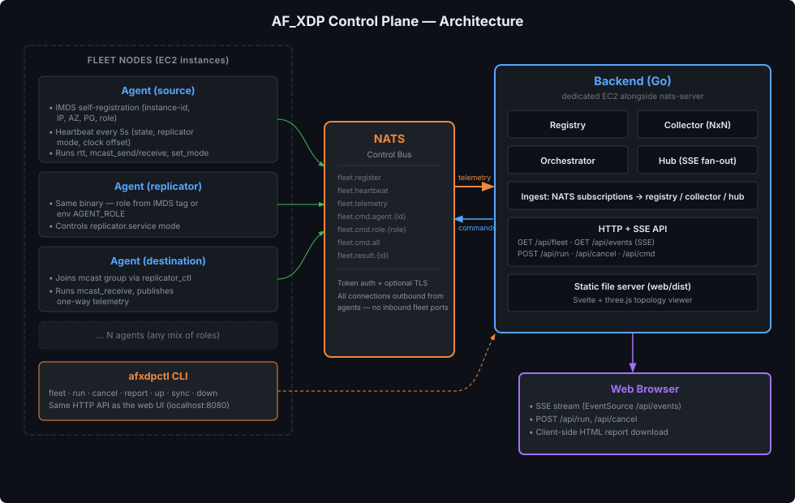
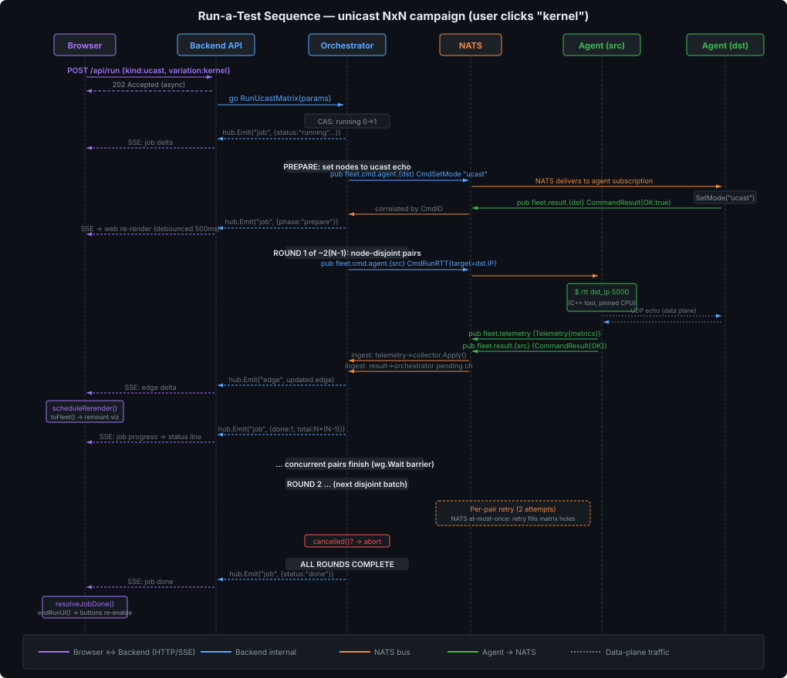

# control_plane - centralized orchestration + live monitoring for the AF_XDP benchmark

Replaces the fragile SSH/ansible + AWS-creds-in-the-loop orchestration with a
push-button control plane: a Go **agent** on every fleet node, a central Go
**backend** (registry + orchestrator + collector + API), a **NATS** control bus,
and a Svelte/three.js **web** app for live monitoring and launching tests. The
existing offline **report** generators (`gen/`) still turn a results dir into a
heatmap + topology model.

```
control_plane/
├── proto/       # shared wire contract (NATS subjects + message schemas) - Go, no deps
├── agent/       # per-node sidecar: IMDS self-register, run rtt/mcast, stream telemetry
├── backend/     # registry, NxN collector, orchestrator, store, HTTP+SSE API, serves web/
├── web/         # Svelte + three.js: live 2D/3D topology + shared control panel
├── gen/         # offline: per-pair JSON → heatmap + fleet.json (afxdp.topology/v1)
├── mcp/         # read-only MCP server (exposes the SQLite results DB to AI tooling)
├── cmd/afxdpctl # CLI that wraps the backend HTTP API + CDK/ansible for the dev loop
└── assets/      # documentation diagrams (SVG)
```

One Go module (`afxdp-cp`); agent + backend + proto share the wire contract. The
agent is merely *deployed* to nodes (via the AMI bake); the backend runs on a
small dedicated EC2 (see Deployment).

---

## Architecture overview



---

## Why NATS + agents (vs SSH/ansible)

The benchmark showed that SSH-driven orchestration is fragile at the exact
moment it matters: an `--xdp-tx` run can grab NIC queue 0 and starve the SSH
session; creds expire mid-campaign; cross-VPC/region fans out into bespoke
inventories. The agent model fixes this:

- **Agent-outbound only.** Agents open ONE persistent NATS connection *outbound*
  to the backend. No inbound ports on fleet nodes, no SSH in the hot path, so a
  runaway XDP program can never lock out control.
- **Self-registration via IMDS.** Each agent discovers its own instance-id / IP /
  AZ / PG / role and registers - automated inventory.
- **The agent owns the node's resource lifecycle** (queue-free, clock makestep,
  isolated-core pinning, replicator mode/service). The backend issues *intents*,
  not shell.

---

## NATS control bus (proto/subjects.go)

All communication uses a flat NATS subject space. Agents **PUBLISH** to
`fleet.register`, `fleet.heartbeat`, `fleet.telemetry`, and `fleet.result.<id>`.
Agents **SUBSCRIBE** to their addressed command subjects (per-id, per-role, and
broadcast). The backend does the mirror.

| Subject | Direction | Payload |
|---|---|---|
| `fleet.register` | agent → backend | `Registration` (on connect + every ~5th heartbeat) |
| `fleet.heartbeat` | agent → backend | `Heartbeat` (liveness/state/replicator mode, every ~5 s) |
| `fleet.telemetry` | agent → backend | `Telemetry` (one measurement sample, tagged with src/dst/kind/variation) |
| `fleet.cmd.all` | backend → every agent | `Command` (broadcast) |
| `fleet.cmd.role.<role>` | backend → agents of that role | `Command` (role-targeted) |
| `fleet.cmd.agent.<instance-id>` | backend → one agent | `Command` (unicast inbox) |
| `fleet.result.<instance-id>` | agent → backend | `CommandResult` (correlated by `CmdID`) |

The backend subscribes to the wildcard `fleet.result.*` so it can route results
to the waiting goroutine regardless of which agent produced them.

---

## Agent internals (agent/)

### Self-registration via IMDS

On startup the agent uses **IMDSv2** (token-authenticated, 2 s timeout) to
discover:

| Field | IMDS path | Env fallback |
|---|---|---|
| InstanceID | `/meta-data/instance-id` | `AGENT_INSTANCE_ID` |
| PrivateIP | `/meta-data/local-ipv4` | `AGENT_PRIVATE_IP` |
| PublicIP | `/meta-data/public-ipv4` | - |
| AZ | `/meta-data/placement/availability-zone` | - |
| Region | `/meta-data/placement/region` | `AWS_REGION` |
| InstanceType | `/meta-data/instance-type` | - |
| PlacementGroup | `/meta-data/placement/group-name` | `AGENT_PG` |
| Role | `/meta-data/tags/instance/Role` | `AGENT_ROLE` |
| Stack | `/meta-data/tags/instance/aws:cloudformation:stack-name` | - |

If IMDS is unavailable (off-EC2 development), set `AGENT_NO_IMDS=1` and provide
the fields via environment variables.

### Heartbeats

A goroutine publishes a `Heartbeat` every 5 s (configurable via `-heartbeat`):

```json
{
  "instance_id": "i-0abc123...",
  "unix": 1722654321,
  "state": "idle",
  "replicator_mode": "ucast",
  "replicator_svc": "active",
  "clock_offset_us": 0.42,
  "current_cmd_id": ""
}
```

Every 5th heartbeat the agent also re-sends its full `Registration` to recover
from a backend restart (the backend's NATS connection stays up, so the client
reconnect handler wouldn't fire otherwise).

### Command execution model

The agent serializes all command execution behind a mutex (`execMu`): the node
has **one** AF_XDP queue and fixed `/tmp` result files, so two commands must
never run concurrently (even though NATS delivers `cmd.all`, `cmd.role.*`, and
`cmd.agent.*` on separate goroutines).

Supported commands:

| CmdType | Action |
|---|---|
| `ping` | Echo "pong" + agent version |
| `reregister` | Re-publish Registration immediately |
| `cleanup` | Kill mcast_send/mcast_receive + detach XDP from the NIC |
| `clock_sync` | `chronyc makestep` + burst, return achieved offset µs |
| `set_fwd_mode` | Set `REPLICATOR_FWD_MODE` (copy\|inplace\|bpf_tx) in `/etc/default/replicator` + restart service |
| `set_mode` | Set `REPLICATOR_MODE` (+ fwd) + restart service |
| `replicator_svc` | `systemctl stop/start/restart replicator` |
| `join_group` | `replicator_ctl <ip> mcast <group>` (join mcast group) |
| `run_rtt` | Execute the C++ `rtt` tool → returns Metrics + publishes Telemetry |
| `mcast_receive` | Execute `mcast_receive` (blocks until count/timeout) → returns Metrics + publishes Telemetry |
| `mcast_send` | Execute `mcast_send` burst (non-blocking sender side) |

On completion of any measurement command (`run_rtt`, `mcast_receive`), the agent
publishes **both** a `CommandResult` (on `fleet.result.<id>`) and a `Telemetry`
(on `fleet.telemetry`).

### CPU pin derivation

The agent derives send/receive CPU pins from the intersection of `isolcpus=` and
the kernel online set - highest two isolated cores (send = highest, recv =
second-highest). This adapts to instance size without hardcoding and never pins
to an offline core (which would silently fall back to CPU 0, inflating latency).

---

## Backend components + logic (backend/)

Package layout: `hub/`, `registry/`, `collector/`, `store/`, `pairs/`,
`orchestrator/`, `ingest/`, `errorreg/`, `api/`, with `main.go` as wiring.

### store/ - SQLite persistence

A SQLite database (WAL mode) persists every measurement and campaign run.
Schema: `runs` (id, started/ended, kind, variation, scope, target_ids, params,
pair counts) and `measurements` (run_id FK, timestamps, kind, variation, src/dst,
percentiles, loss). For mcast, each `(replicator, mode)` combination the
orchestrator sweeps gets its own `runs` row, with the replicator's
`instance_id`/`private_ip`/`placement_group`/`az` recorded in `params` - this is
what lets `LatestMcastReplicatorResults` (backing `GET /api/mcast-replicators`)
attribute every measurement to the replicator path that produced it, even
though the wire `Telemetry` message itself only carries src/dst IPs. The store
is also consumed read-only by the MCP server (`control_plane/mcp/`).

### pairs/ - pair expansion

Expands a `nodes[]` + `scope` into ordered `(src, dst)` pairs. Scopes: `among`
(full NxN mesh among the selected nodes), `fanout` (one selected node sends to
all others), `fanin` (all others send to one selected node).

### errorreg/ - error registry

Accumulates per-node errors from failed commands so they can be queried at
`GET /api/errors`.

### registry.go - fleet state

Authoritative in-memory fleet keyed by InstanceID. `Upsert` on register, update
on heartbeat, staleness window → offline (default 20 s). Query helpers:

- `Online()` - all live nodes (ucast campaign scope)
- `ByRole(role)` - first online node with a specific role
- `AllByRole(role)` - all online nodes of a role (e.g. all destinations, or every replicator for the mcast sweep)

### collector.go - NxN measurement matrix

Edges keyed **`kind|variation|src|dst`** (+ a 60-entry p50 history ring for
sparklines). The `kind` in the key matters whenever a ucast and mcast variation
happen to share a name (e.g. both could be `"xdp"`-flavored) - without it they'd
collide on src→dst alone.

`Apply(Telemetry)` updates or creates the edge and returns a copy for SSE broadcast.

### orchestrator.go - campaigns + dispatch

Dispatches commands to agents via NATS `fleet.cmd.agent.<id>`, correlates their
`CommandResult` by `CmdID` from the wildcard `fleet.result.*` subscription. Only
**one campaign** may run at a time (CAS guard on `running`).

**Key behaviors:**

- `Dispatch(subject, cmd, timeout)` - publish + wait for correlated result (or timeout).
- `dispatchRetry(instanceID, cmd, timeout, attempts)` - retry a command up to N times on error/!OK. Core NATS is at-most-once: a retry fills a matrix hole.
- `Cancel()` - sets an atomic flag; the running campaign aborts at its next safe boundary (round for ucast, mode for mcast).
- `scheduleRounds(n)` - packs N×(N−1) ordered pairs into node-disjoint rounds for parallel execution (see below).
- `RunMcastMatrix` automatically sweeps **every online replicator** (see
  [Multi-replicator mcast campaigns](#multi-replicator-mcast-campaigns) below) -
  a fleet with several replicator placements (different PG/AZ) gets every
  placement measured in one campaign, not just whichever the registry
  returned first.

### ingest.go - NATS→state bridge

Subscribes to `fleet.register`, `fleet.heartbeat`, `fleet.telemetry`:

- **Registration** → `registry.Upsert` → `hub.Emit("node", …)`
- **Heartbeat** → `registry.Heartbeat` → `hub.Emit("node", …)` only if a material field changed (state, mode, or online transition - not every tick)
- **Telemetry** → `collector.Apply` → `hub.Emit("edge", …)`

If a heartbeat arrives from an unknown instance (e.g. after a backend restart),
the ingest publishes a `CmdReregister` nudge so the agent repopulates immediately.

### hub.go - SSE fan-out

Fan-out to SSE clients. Each subscriber gets a buffered channel (256 entries);
slow clients are dropped (channel full) rather than blocking the ingest path.

### api.go + main.go - HTTP server

Serves the HTTP+SSE API and the built web app (`web/dist`).

---

## HTTP + SSE API

| Endpoint | Method | Purpose |
|---|---|---|
| `/api/fleet` | GET | Full snapshot `{generated_unix, nodes[], edges[]}` - for late joiners / batch view |
| `/api/events` | GET | SSE stream: `snapshot` on connect, then `node`/`edge`/`job` deltas + keepalives |
| `/api/run` | POST | Start a campaign (async, returns `202 Accepted`) |
| `/api/cancel` | POST | Request the running campaign to abort at the next boundary |
| `/api/cmd` | POST | Dispatch an ad-hoc command to one agent `{instance_id, command}` |
| `/api/errors` | GET | Node errors (all, or `?node=<id>` for one node) |
| `/api/mcast-replicators` | GET | Per-replicator mcast measurement history from the store (`?since_run_id=`, `?limit=`) - backs the web report's "Per-replicator paths" section; see [Multi-replicator mcast campaigns](#multi-replicator-mcast-campaigns) |
| `/api/measurements` | GET | General store-backed report data, both kinds (`?kind=`, `?since_unix=`, `?limit=`) - backs every other report table (Latest measurements, per-mode heatmaps, All measurements); see [Multi-replicator mcast campaigns](#multi-replicator-mcast-campaigns) |
| `/healthz` | GET | Liveness probe |

### SSE event types (`/api/events`)

On connect the backend sends a `snapshot` with the full `{nodes, edges}`. Then
incremental deltas flow:

| `type` | `data` | When |
|---|---|---|
| `snapshot` | `{nodes:[], edges:[]}` | Once, on client connect |
| `node` | single Node object | Registration or material heartbeat change |
| `edge` | single Edge object | New measurement telemetry applied |
| `job` | campaign progress object | Orchestrator lifecycle events (running/progress/done/cancelled/error/rejected) |

Keepalive comments (`: keepalive\n\n`) are sent every 20 s to prevent proxy
timeouts from closing the connection.

### POST /api/run body

The `kind` field selects the campaign type; remaining fields are campaign-specific:

**ucast** (`UcastMatrixParams`):

```json
{
  "kind": "ucast",
  "variation": "kernel",
  "count": 5000,
  "rate": 20000,
  "warmup": 1000,
  "nodes": ["i-abc123", "i-def456"],
  "scope": "among"
}
```

- `variation` (singular): `kernel` | `xdp` (default `kernel`). `xdp` runs AF_XDP
  zero-copy TX **and** RX together - there is no separate xdp-tx-only /
  xdp-rx-only campaign variation at this level (that split exists only inside
  the low-level `rtt` CLI's own `--xdp-tx`/`--xdp-rx` flags, see
  [`tools/README.md`](../tools/README.md)).
- `nodes` (optional): restrict the campaign to these instance IDs. Empty = full NxN mesh.
- `scope` (optional): `among` (default) | `fanout` | `fanin` - expands `nodes` into ordered pairs.

**mcast** (`McastMatrixParams`):

```json
{
  "kind": "mcast",
  "modes": ["copy", "inplace", "bpf_tx"],
  "count": 10000,
  "interval_us": 200,
  "timeout_sec": 30
}
```

- `modes`: subset of `copy` | `inplace` | `bpf_tx` (default: all three).

Runs against **every online replicator** automatically (see
[Multi-replicator mcast campaigns](#multi-replicator-mcast-campaigns)); there is
no field yet to restrict this to a subset.

---

## Orchestrator optimizations

### Round-based parallel NxN scheduler

The contention rule is: a node may be in only one live measurement at a time (as
sender *or* echo target). So all ordered pairs are packed into **node-disjoint
rounds** - within a round no node appears twice, so every pair runs
**concurrently**; rounds run serially behind a `sync.WaitGroup` barrier.

This turns the naïve O(N²) serial matrix into **~2(N−1) rounds of up to ⌊N/2⌋
concurrent pairs** (≈O(N) wall-clock). (At N≤3 there is no concurrency to be
had - any pair uses 2 of 3 nodes.)

### Per-pair retry

`dispatchRetry` sends a command up to 2 attempts. Core NATS is at-most-once, so
a dropped command/result is transient; a retry fills the matrix hole instead of
leaving a gap.

### Prepare-phase skip

Before a ucast campaign, the orchestrator checks each node's last heartbeat
state: nodes already in `ucast` mode with an active replicator service are
**skipped** (no expensive SetMode round-trip). This makes heartbeat re-runs cheap
when the fleet is already prepared.

### mcast setup barriers

`RunMcastMatrix` encodes the proven sequence per fwd mode:

1. Replicator `set_mode mcast/<fwd>` (skipped if `lastMcastFwd` matches)
2. Source + destination cleanup (free AF_XDP queue)
3. Destinations `join_group` behind the replicator
4. **Clock gate** (`clock_sync`) on all participants
5. Start receivers concurrently → 3 s settle → fire source send → await
6. Queue-free cleanup per destination (release queue for the next mode)

The entire run phase (step 5) is itself **retryable** (2 attempts per mode).

### Cancel semantics

`POST /api/cancel` sets an atomic flag checked at each round boundary (ucast) or
mode boundary (mcast). In-flight measurements already dispatched run to
completion; no new work is started. For mcast, a background goroutine polls the
cancel flag every 500 ms and kills in-flight `mcast_send`/`mcast_receive`
processes via a `cleanup` command so the blocking dispatch returns promptly.

---

## End-to-end: what happens when a user clicks a test button



### Detailed trace (ucast "kernel" example)

1. **Web**: User clicks the "kernel" button in the Test Latency section.
2. **Web → Backend**: `POST /api/run` with `{"kind":"ucast","variation":"kernel","count":5000,"rate":20000,"warmup":1000}`.
3. **Backend API**: Returns `202 Accepted` immediately. Spawns a goroutine calling `RunUcastMatrix(params)`.
4. **Orchestrator**: CAS `running` 0→1 (rejects if a campaign is already active). Resets the cancel flag.
5. **Orchestrator → Hub**: Emits `job {status:"running", kind:"ucast", variation:"kernel", pairs:N*(N-1), rounds:…}`.
6. **Hub → Browser**: SSE delivers the delta; the web status line updates.
7. **Prepare phase**: For each node whose heartbeat shows `replicator_mode != "ucast"` or `replicator_svc != "active"`, the orchestrator dispatches `CmdSetMode{mode:"ucast"}` in parallel (with retry). Nodes already set are skipped.
8. **Round scheduling**: `scheduleRounds(N)` packs all N*(N-1) ordered pairs into node-disjoint rounds.
9. **Per round**: All pairs are launched concurrently (goroutines). Each pair:
   - Dispatches `CmdRunRTT` to the source agent (with target IP of the destination).
   - The agent executes the C++ `rtt` tool (pinned to isolated CPUs).
   - The destination node echoes packets via its running replicator in ucast mode.
   - On completion the agent publishes `Telemetry` (→ collector → hub → SSE `edge` delta) **and** `CommandResult` (→ orchestrator unblocks).
   - Progress events flow to the hub.
10. **Round barrier**: `wg.Wait()` blocks until all pairs in the round finish.
11. **Cancel check**: Between rounds, `cancelled()` is checked. If set, emits `job {status:"cancelled"}` and returns.
12. **Completion**: After all rounds, emits `job {status:"done"}`. The web resolves its `waitForDone()` promise, clears the active button state, and re-enables all buttons.

### Multicast trace

The multicast campaign (`RunMcastMatrix`) follows a different topology:
**source → replicator → destination(s)** (fan-out). A fleet may have several
online replicators (different PG/AZ placements); the campaign automatically
sweeps **every one of them**, so the sequence below repeats once per
replicator:

1. Identify online nodes by role: `source`, every online `replicator`, all `destination`s.
2. Stop the replicator service on source + destinations (free AF_XDP queue) - once, shared across all replicators.
3. For each replicator, for each fwd mode (`copy`, `inplace`, `bpf_tx`):
   - Open a `runs` row tagging this replicator's identity/PG/AZ (see [Multi-replicator mcast campaigns](#multi-replicator-mcast-campaigns)).
   - Set that replicator to `mcast/<mode>` (skipped if already set).
   - Destinations join the multicast group + clock-sync gate.
   - Launch destination receivers concurrently (blocks until count/timeout).
   - After 3 s settle, fire the source send (to this replicator's IP).
   - Receivers complete → publish Telemetry (one-way latency, src→replicator→dst).
   - Cleanup queues for the next mode.
4. Emit `job {status:"done", kind:"mcast"}` once every replicator has been swept.

## Multi-replicator mcast campaigns

A fleet's `replicator`-role nodes are not required to be a single node - a
common setup has several, each in a different placement group / AZ, to compare
latency across replicator placement. `RunMcastMatrix` handles this
automatically: it calls `registry.AllByRole("replicator")` instead of picking
one, and sweeps `{replicator} x {mode}` - every online replicator against
every requested mode, in one campaign.

**Attribution.** Each `(replicator, mode)` combination gets its own `runs` row
via `store.InsertRun`, with `params` carrying the replicator's
`instance_id`/`private_ip`/`placement_group`/`az`. This exists because the live
collector's edges are keyed only by `(kind, variation, src_ip, dst_ip)` - if
replicator A and replicator B both measure the same destination, B's result
would silently overwrite A's in the live view. The `runs`/`measurements` join
in the store is the only place every replicator's numbers survive
simultaneously.

**Consuming it.** Two read endpoints, both used by the web report
(`control_plane/web/src/lib/report-combined.js`), which is now entirely
store-backed rather than reading the live `/api/fleet` snapshot:

- `GET /api/mcast-replicators` (`store.LatestMcastReplicatorResults`): most
  recent measurement per `(replicator, mode, src, dst)`, mcast only, decoding
  replicator identity out of the owning run's `params`. Params: `since_run_id`
  (floor to one campaign), `limit` (default 500). Backs the report's dedicated
  "Per-replicator paths" table.
- `GET /api/measurements` (`store.LatestMeasurements`): the general
  counterpart, covering **both** ucast and mcast - most recent measurement per
  `(kind, variation, src, dst, replicator)` edge (`replicator_ip` is `""` for
  ucast), joined with each endpoint's topology from the `nodes` table. Params:
  `kind` (`"ucast"`\|`"mcast"`, default both), `since_unix` (default now-24h,
  so an unscoped report load never forces a scan of the full retention
  window), `limit` (default 2000, after dedup). Backs every OTHER table in the
  report - Latest measurements, per-mode heatmaps, All measurements - which is
  what makes those correctly show every replicator's numbers too, not just
  the dedicated section.

See [`web/README.md`](web/README.md#mock-server-mockserverjs-topologymjs) for
how the report renders this and how the mock server reproduces both endpoints
for UI work without a real fleet. The report auto-refetches every 180s while
open plus an explicit Refresh button, and no longer re-renders on live SSE
ticks at all.

**Not yet implemented:** choosing which replicator(s) to run instead of always
sweeping all of them. Every mcast campaign today pays the full
`N replicators x M modes` wall-clock cost. See
`dev/roadmap/mcast-replicator-selection.md` for the planned `Replicators []string`
selector on `McastMatrixParams` and the corresponding control-panel multi-select
(dashboard work, deliberately separate from the report-only change that
shipped the automatic sweep).

---

## Live (heartbeat) mode vs one-shot tests

These are **two distinct modes** in the web UI:

| | One-shot test | Live (heartbeat) mode |
|---|---|---|
| Trigger | Click a test button once | Toggle "Live" → select a mode + interval |
| Repeat | Never - runs once and finishes | Re-runs every N seconds (min 30 s) |
| SSE connection | Always open (independent of test) | Always open |
| Backend concurrency | One campaign at a time | Same - queues are rejected while running |
| Parameters | Full 5000-packet runs (user-configurable) | Smaller 1000-packet bursts (quick pulse) |
| UI behavior | Active button turns orange until done | Selected heartbeat button stays orange continuously |

Live mode is designed for continuous monitoring during development: re-run a
chosen test at a configurable interval (floor 10 s to stay resource-sane), watch
the matrix fill in over time with sparkline history.

---

## Campaign cancel (POST /api/cancel)

- Sets an atomic cancel flag.
- **Ucast**: checked between rounds. The current round's in-flight pairs finish;
  no new round starts.
- **Mcast**: checked between modes AND during the measurement phase (a background
  goroutine polls every 500 ms and sends `cleanup` commands to source +
  destinations to kill in-flight `mcast_send`/`mcast_receive` processes).
- Status `cancelled` is emitted via SSE; the web resolves the done-waiter and
  re-enables buttons.

---

## Downloadable HTML report

The web app includes a "download report" button (⤓ icon) that generates a
**self-contained HTML file** in the browser:

- **Store-backed, not the live in-memory model.** The report fetches flat rows
  from `GET /api/measurements` + `GET /api/mcast-replicators` (see
  [Multi-replicator mcast campaigns](#multi-replicator-mcast-campaigns)) and
  builds every table from those - Latest measurements overview, per-mode
  heatmaps, a combined All measurements table, and (mcast) a dedicated
  Per-replicator paths table. This is what lets the report show every
  replicator's numbers, not just whichever one measured a destination most
  recently.
- Assembled in `lib/report-combined.js`; the fetch + open/refresh wiring lives
  in `App.svelte`. `lib/report.js`'s `buildReportHTML` remains a live-model
  helper (kept for potential future single-mode use) but is not wired into
  the app; its `buildCompareHTML` is reused internally for the combined
  report's delta view.
- Auto-refetches every 180s while the live overlay is open, plus an explicit
  Refresh button; the standalone downloaded HTML omits Refresh (no backend to
  refresh against) but keeps Save as PDF / Save as XLS.
- File naming: `latency-report-<modes>-<timestamp>.html` (live overlay) /
  same pattern for the PDF export.

---

## Multicast rendering in the web UI

Multicast telemetry edges are `src_ip → dst_ip` (source → destination), but the
physical path is **source → replicator → destination**. The web viewer (`live.js`)
handles this:

- When `kind === "mcast"`, the viewer finds the replicator node index.
- For each measured edge (src→dst), it places the metric on **two** matrix
  cells: `source → replicator` (shared first hop) and `replicator → destination`
  (measured last hop).
- The 2D/3D topology therefore shows the fan-out through the replicator node,
  matching the physical datapath.

---

## Test variations + datapath semantics

Driven from the web panel or `POST /api/run`.

**ucast (round-trip through the echo replicator), variations:**

| variation | client TX | client RX | what it measures |
|---|---|---|---|
| `kernel` | `sendto()` | kernel busy-poll socket, kernel-SW RX ts | tuned kernel path (the honest floor) |
| `xdp` | AF_XDP zero-copy | kernel socket + XDP-stamped ts | removes the kernel TX stack (zero-copy TX) AND uses an **XDP-stamped** ingress ts on RX (NOT a kernel bypass on the RX side) - both together, driven by one `variation` value |

**mcast (one-way source → replicator fan-out → dest), fwd modes:** `copy`,
`inplace`, `bpf_tx` - set on the replicator per mode; one-way latency uses the
XDP/PHC ingress stamp on the destination, gated on clock convergence.

---

## afxdpctl CLI (cmd/afxdpctl)

A single-binary CLI that wraps the backend HTTP/SSE API and CDK/ansible for the
full dev loop. Talks to `-cp` (default `$CP_URL` or `http://localhost:8080`).

### Measurement commands

```bash
afxdpctl fleet                       # show online nodes + edge count
afxdpctl run ucast kernel            # launch a ucast/kernel campaign (streams events to stdout)
afxdpctl run ucast xdp               # ucast with AF_XDP zero-copy TX + XDP-stamped RX
afxdpctl run mcast copy,inplace,bpf_tx  # multicast with all three fwd modes
afxdpctl cancel                      # abort the running campaign
afxdpctl report -o results.html      # download an HTML report from current data
afxdpctl report -kind mcast          # filter report to mcast edges only
```

`afxdpctl run` opens an SSE stream and prints each `job` event until a terminal
status (`done`/`cancelled`/`error`/`rejected`), then prints the edge matrix.

### Infrastructure commands

```bash
afxdpctl up   --key virginia --git-repo <url> --git-ref main --scenario ucast-az-cpg-3 [--bake]
afxdpctl sync --key ~/.ssh/virginia.pem --region us-east-1
afxdpctl down --key virginia --scenario ucast-az-cpg-3
```

| Command | What it does |
|---|---|
| `up` | Deploys control-plane stack + (optionally) AMI builder + fleet via CDK |
| `sync` | Hot-deploys code to running instances via ansible (dev iteration) |
| `down` | Destroys stacks in reverse dependency order |

---

## Security (NATS auth + TLS)

- **Token auth** everywhere: agent (`AGENT_NATS_TOKEN`), backend (`-nats-token`),
  `nats-server` `authorization { token }`. A wrong token is rejected with
  `Authorization Violation`.
- **Optional TLS**: agent (`AGENT_NATS_CA` to validate, or `AGENT_NATS_INSECURE`
  for self-signed), backend (`-nats-insecure`), `nats-server tls {}` with a
  self-signed cert generated on the host (`-c natsTls=true`).
- The `ControlPlaneStack` generates the token, writes `nats.conf`, and publishes
  the endpoint + token to SSM (`/af-xdp/nats-url`, `/af-xdp/nats-token`); baked
  agents fetch both at boot.
- **Known gap (lab-grade):** the token is a String SSM param (IAM-scoped to
  `af-xdp/*`), not `SecureString`; `clientCidr` defaults to `0.0.0.0/0`. Tighten
  both for anything beyond a lab (`-c clientCidr=…`, SecureString + KMS).

---

## Deployment (dedicated EC2 + CDK)

NATS needs a raw TCP endpoint, so a small dedicated EC2 beats ECS here. Fleets
live in separate VPCs/regions, so the control plane gets a **public EIP** and
agents connect *outbound* - no VPC peering.

```bash
# 1) Control plane (EC2 + EIP + SG + nats-server + backend; publishes SSM endpoint)
cdk deploy --context deploymentType=control-plane \
  --context keyPairName=<key> --context gitRepo=<repo> --context gitRef=<branch> \
  [--context clientCidr=1.2.3.4/32] [--context natsTls=true] \
  [--context hostedZoneId=Z... --context zoneName=example.com --context recordName=bench.example.com]

# 2) Fleet AMI: `bake-ami.sh` builds + installs the agent (systemd afxdp-agent.service)
#    and each fleet node stamps its AGENT_ROLE + fetches the NATS url/token from SSM.

# 3) Backend serves the web app; open http://<eip>:8080  (or the Route53 name)
```

### Backend flags / environment

| Flag | Env | Default | Purpose |
|---|---|---|---|
| `-nats` | `CP_NATS_URL` | `nats://localhost:4222` | NATS server URL |
| `-nats-token` | `CP_NATS_TOKEN` | (none) | NATS auth token |
| `-nats-insecure` | `CP_NATS_INSECURE` | off | Skip TLS verify (self-signed) |
| `-addr` | `CP_HTTP_ADDR` | `:8080` | HTTP listen address |
| `-web` | `CP_WEB_DIR` | auto-detect `web/dist` | Static web dir |
| `-stale` | - | `20` | Seconds without heartbeat → offline |

### Agent flags / environment

| Flag | Env | Default | Purpose |
|---|---|---|---|
| `-nats` | `AGENT_NATS_URL` | `nats://localhost:4222` | NATS server URL |
| `-bindir` | `AGENT_BIN_DIR` | `/opt/af-xdp` | Directory of C++ measurement tools |
| `-heartbeat` | - | `5` | Heartbeat interval (seconds) |
| - | `AGENT_NATS_TOKEN` | (none) | NATS auth token |
| - | `AGENT_NATS_CA` | (none) | CA file to validate NATS TLS |
| - | `AGENT_NATS_INSECURE` | (none) | Skip TLS verify (self-signed) |
| - | `AGENT_NO_IMDS` | (none) | Disable IMDS (off-EC2 dev) |
| - | `AGENT_ROLE` | (none) | Fallback role if IMDS tag unavailable |

---

## Scale characteristics + limits

- Great for **tens** of nodes. The round scheduler makes ucast ~O(N) wall-clock;
  telemetry/heartbeat rates are trivial for NATS.
- Past hundreds of nodes: `Snapshot()` copies the whole NxN per `/api/fleet` and
  per new SSE client, collector history rings dominate memory, and the NxN viz
  itself becomes unusable - all need pagination / bounded snapshots / sampling.
- The web fully remounts the topology per live update (debounced 500 ms); fine at
  tens of nodes, janky for very large N (prefer in-place edge updates there).

---

## Offline report pipeline (gen/)

Independently of the live path, a results dir of per-pair JSON can be turned into
a heatmap + topology model (used by `run_ucast.yaml` / `run_mcast.yaml`, and
reusable on any saved run):

```bash
python3 control_plane/gen/report.py      results/<date>/<run>
python3 control_plane/gen/fleet_json.py  results/<date>/<run>
```

| File | Produced by | Contents |
|---|---|---|
| `<src_ip>-<dst_ip>.json` | tools (`-j`) | per-pair `service_rtt_us` (+ `hop1_us`/`hop2_us` for mcast) |
| `matrix_report.html` | `report.py` | heatmap; hover → p50/p99/loss (+ hop split for mcast) |
| `matrix_summary.json` | `report.py` | full NxN incl. hop percentiles |
| `fleet.json` | `fleet_json.py` | `afxdp.topology/v1` model for the web viewer |

The same `fleet.json` schema is what the live backend adapts to, so the 2D/3D
viewer renders both saved runs and the live stream identically.

---

## Read-only MCP server (mcp/)

A Model Context Protocol (MCP) server that opens the backend's SQLite database
in **read-only mode** (`mode=ro` in the DSN) and exposes measurement history and
run metadata to AI tooling via JSON-RPC 2.0 over stdio. The read-only guarantee
is enforced at the connection level and verified by tests - no write can succeed
regardless of the query issued.

Entry point: `mcp/cmd/main.go`. The server is a separate binary; it does not run
inside the backend process.

---

## Build + test

```bash
cd control_plane
go build ./... && go vet ./... && go test -race ./...   # backend + agent + proto
cd web && npm ci && npm run build                        # web/dist (served by the backend)
```

---

## License

This project is licensed under the MIT-0 License. See the LICENSE file.
