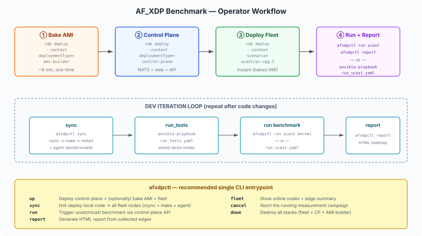

# Infrastructure and Provisioning for the AF_XDP Latency Benchmark

## Architecture


The deployment consists of three independently deployable CDK stacks plus ansible-driven runtime operations:

| Stack | `deploymentType` | Purpose |
|-------|-------------------|---------|
| **AMI Builder** | `ami-builder` | Builds a universal, pre-tuned AMI (~9 min), writes its ID to SSM |
| **Control Plane** | `control-plane` | Single EC2 (EIP) running NATS + Go backend + web dashboard |
| **Fleet** | `fleet` (default) | N×EC2 instances from a JSON scenario; resolves AMI from SSM |

Fleet agents connect **outbound** to the control-plane's NATS endpoint (discovered via SSM `/af-xdp/nats-url`), so no VPC peering is needed between the control-plane and fleet VPCs.

## Operator Workflow



## Structure

```
deploy/
├── assets/                SVG diagrams (referenced by markdown docs)
├── cdk/                   CDK infrastructure (Fleet + AMI Builder + Control Plane stacks)
│   ├── bin/app.ts         Entry point - deployment type routing
│   ├── lib/               Stack constructs (FleetStack, AmiBuilderStack, ControlPlaneStack)
│   ├── scenarios/         Pre-built fleet topologies (u-*, m-*, all)
│   └── scripts/           AMI bake script (configs, binaries, systemd)
│
└── ansible/               Runtime/benchmark playbooks + shared inventory
    ├── run_ucast.yaml     Unicast NxN RTT benchmark + report
    ├── run_mcast.yaml     Multicast fan-out benchmark
    ├── configure_mcast.yaml  Multicast runtime setup (m2u, replicator, registration)
    └── inventory.aws_ec2.yml  Dynamic EC2 inventory by Role tag

Dev/iteration tooling lives outside deploy/, under af_xdp/dev/:

    dev/
    ├── Dockerfile         Local build + test harness (mirrors the AMI bake)
    └── ansible/           provision.yaml, sync.yaml, run_tests.yaml (+ inventory symlink)
```

## Quick Start (recommended - `afxdpctl`)

The `afxdpctl` CLI (at `control_plane/cmd/afxdpctl`) is the recommended single entrypoint for the full lifecycle:

```bash
# 1. Deploy everything (control-plane + optional AMI bake + fleet)
afxdpctl up --key virginia --git-repo <repo-url> --git-ref main \
            --scenario u-cpg-3 --bake

# 2. Hot-deploy local code changes
afxdpctl sync --key ~/.ssh/virginia.pem --region us-east-1

# 3. Run a benchmark
afxdpctl run ucast kernel           # or: xdp (AF_XDP zero-copy TX)
afxdpctl run mcast copy,inplace,kernel

# 4. Generate report
afxdpctl report -o results.html

# 5. Tear down
afxdpctl down --key virginia --scenario u-cpg-3
```

## Manual Deployment Flow

### Production (baked AMI)

```bash
cd deploy/cdk && npm install

# 1. Build AMI (~9 min, one-time)
npx cdk deploy --context deploymentType=ami-builder \
               --context keyPairName=virginia \
               --context gitRepo=<repo-url> --context gitRef=main

# 2. Deploy control plane
npx cdk deploy --context deploymentType=control-plane \
               --context keyPairName=virginia \
               --context gitRepo=<repo-url> --context gitRef=main

# 3. Deploy fleet (instant readiness - AMI resolved from SSM)
npx cdk deploy --context keyPairName=virginia \
               --context scenario=u-cpg-3

# 4. Run benchmarks
ansible-playbook -i ../ansible/inventory.aws_ec2.yml ../ansible/run_ucast.yaml
```

### Development (stock AL2023)

```bash
# 1. Deploy fleet (stock AMI - skips SSM; needs ansible provisioning)
npx cdk deploy --context keyPairName=virginia \
               --context scenario=u-cpg-3 \
               --context amiId=resolve:ssm:/aws/service/ami-amazon-linux-latest/al2023-ami-kernel-default-x86_64

# 2. Provision instances (~8 min)
cd ../../dev/ansible
ansible-playbook -i inventory.aws_ec2.yml provision.yaml

# 3. Iterate (after code changes)
ansible-playbook -i inventory.aws_ec2.yml sync.yaml
```

### Self-hosted (BYOI - no CDK)

Tag your instances with `Role: source|replicator|destination`, ensure SSH + intra-fleet connectivity, then:

```bash
# 1. Tag instances
aws ec2 create-tags --resources i-xxx --tags Key=Role,Value=replicator

# 2. Provision
ansible-playbook -i inventory.aws_ec2.yml provision.yaml

# 3. Run benchmarks
ansible-playbook -i inventory.aws_ec2.yml run_ucast.yaml
```

See [ansible/README.md](ansible/README.md) for static inventory examples and full BYOI documentation.

## Instance Roles

Assigned via CDK fleet spec `role` field (or manual EC2 tags for BYOI), used as ansible groups:

| Role | Description | Baked behavior (on boot) |
|------|-------------|--------------------------|
| `source` | Market data origin (exchange simulator) | Replicator in echo-mode |
| `replicator` | Packet replicator (AF_XDP or kernel) | Replicator in echo-mode |
| `destination` | Latency measurement endpoint | Replicator in echo-mode |

All nodes boot the same AMI - role determines topology wiring at runtime (via ansible or the control plane).

## Instance Sizing (cost vs cores)

The CDK **scenarios pick the instance type per workload** (via the `FleetEntry.type` field): **mcast → `c7i.2xlarge`**, **ucast → `c7i.4xlarge`**. Instances run `nosmt` (SMT off) for latency stability, so **online cores = vCPUs / 2**, and `bake-ami.sh` isolates a block for the datapath (`isolcpus=1-4`).

| Workload | Instance | Online cores | Datapath cores needed | Fits? |
|----------|----------|:------------:|-----------------------|:-----:|
| **mcast** | `c7i.2xlarge` | 4 (0-3) | 3 - OS + IRQ + 1 app | ✅ |
| **ucast** | `c7i.4xlarge` | 8 (0-7) | 5 - OS + IRQ + replicator-poll + rtt-send + rtt-recv | ✅ |

Core pinning is derived dynamically at runtime from the isolated set, so **one AMI serves all instance sizes**.

## Key Decisions

- **Universal AMI:** One AMI for all roles - no per-role variants needed
- **Replicator on boot:** Every instance starts `replicator.service` in unicast mode by default
- **Mode switching:** `/etc/default/replicator` controls mode (kernel/ucast/mcast)
- **Control-plane agent baked in:** The Go agent is built into the AMI; failure is FATAL (fails the bake)
- **SSM discovery:** Agents discover the NATS URL from SSM at boot (preflight retries for 60s)

## Documentation

- [CDK README](cdk/README.md) - stacks, parameters, fleet spec, scenarios
- [CDK lib/ README](cdk/lib/README.md) - FleetStack + AmiBuilderStack + ControlPlaneStack internals
- [Scenarios README](cdk/scenarios/README.md) - topology table, custom format
- [Scripts README](cdk/scripts/README.md) - bake-ami.sh flow, configs applied
- [Ansible README](ansible/README.md) - playbooks, inventory, variables
- [Dev README](../dev/README.md) - Docker build, sync, provision, test iteration
