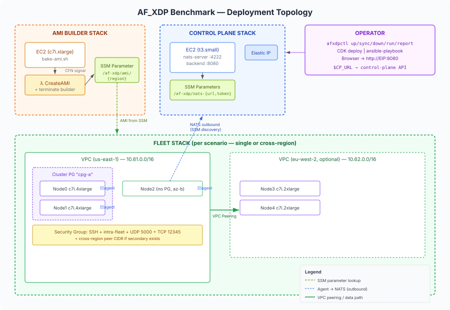

# AF_XDP Benchmark - CDK Deployment

Fleet-driven CDK infrastructure for the AF_XDP latency benchmark. Deploys EC2 instances with configurable placement, multi-AZ, and cross-region topologies from JSON scenario files. Includes an AMI builder for pre-baked instances and a control-plane stack for centralized orchestration.

## Architecture



## Structure

| Directory | Description | Details |
|-----------|-------------|---------|
| [`lib/`](lib/README.md) | CDK stack constructs (FleetStack, AmiBuilderStack, ControlPlaneStack) | Placement validation, cross-region peering |
| [`scenarios/`](scenarios/README.md) | Pre-built fleet topologies (u-*, m-*, all) | 7 scenarios, cost estimates, custom format |
| [`scripts/`](scripts/README.md) | AMI bake script and configs applied | Binaries, sysctl, chrony, systemd units, Go agent |
| `bin/` | CDK app entry point | Fleet resolution, deployment type routing |

## Prerequisites

- AWS CDK CLI (`npm install -g aws-cdk`)
- AWS credentials configured (account bootstrapped with `cdk bootstrap`)
- An EC2 key pair in the target region
- Node.js 18+

## Deployment Types

Three mutually exclusive `deploymentType` values:

| Type | Context value | Description |
|------|---------------|-------------|
| **`fleet`** (default) | `--context scenario=...` or `--context fleet=...` | Deploy EC2 fleet from scenario |
| **`ami-builder`** | `--context deploymentType=ami-builder` | Build pre-baked AMI (~9 min) |
| **`control-plane`** | `--context deploymentType=control-plane` | Central NATS + backend + web dashboard |

## Quick Start

```bash
npm install

# ── Option A: afxdpctl (recommended) ──────────────────────────────────────
afxdpctl up --key virginia --git-repo <repo-url> --git-ref main \
            --scenario u-cpg-3 --bake

# ── Option B: manual CDK commands ─────────────────────────────────────────

# 1. Bake AMI (one-time, ~9 min)
npx cdk deploy --context deploymentType=ami-builder \
               --context keyPairName=virginia \
               --context gitRepo=<repo-url> --context gitRef=main

# 2. Deploy control plane
npx cdk deploy --context deploymentType=control-plane \
               --context keyPairName=virginia \
               --context gitRepo=<repo-url> --context gitRef=main

# 3. Deploy fleet (instant readiness - baked AMI resolved from SSM)
npx cdk deploy --context keyPairName=virginia \
               --context scenario=u-cpg-3

# 4. Deploy fleet with stock AMI (needs provisioning via ansible)
npx cdk deploy --context keyPairName=virginia \
               --context scenario=u-cpg-3 \
               --context amiId=ami-xxxxxx
```

## Fleet Spec

JSON array of `FleetEntry` objects - all fields optional with sensible defaults:

```json
[{"count": 3, "type": "c7i.4xlarge", "pgType": "cluster", "pgName": "cpg-a"}]
```

### FleetEntry Schema

| Field | Type | Default | Description |
|-------|------|---------|-------------|
| `type` | string | `c7i.4xlarge` | EC2 instance type |
| `count` | number | `1` | Number of instances to create |
| `role` | string | `destination` | Logical role: `source`, `replicator`, or `destination` |
| `az` | string | `a` | AZ suffix (e.g. `"a"`) or full name (e.g. `"us-east-1a"`) |
| `pgType` | string | none | Placement strategy: `cluster`, `spread`, or `partition` |
| `pgName` | string | auto | Group label - entries with the same name share a placement group |
| `region` | string | stack region | AWS region - entries with a different region trigger cross-region peering |

### Loading a fleet spec

```bash
# From a scenarios/ file (recommended):
--context scenario=u-cpg-3

# From any JSON file:
--context fleet=@path/to/file.json

# Inline JSON:
--context fleet='[{"count":2,"pgType":"cluster"}]'
```

Priority: `fleet` > `scenario`. If neither is provided, CDK errors with a list of available scenarios.

### Cross-region

Entries whose `region` differs from the primary region create a **second** FleetStack in that region, connected via automatic VPC peering. Only **one** secondary region is supported per deployment.

```json
[
  {"count": 2, "type": "c7i.4xlarge", "pgType": "cluster", "pgName": "us-cpg"},
  {"count": 2, "type": "c7i.4xlarge", "pgType": "cluster", "pgName": "eu-cpg", "region": "eu-west-2"}
]
```

## Context Parameters (complete reference)

### All deployment types

| Parameter | Default | Description |
|-----------|---------|-------------|
| `keyPairName` | **(required)** | SSH key pair name (must exist in the target region) |
| `deploymentType` | `fleet` | One of: `fleet`, `ami-builder`, `control-plane` |
| `region` | `us-east-1` | Primary AWS region |
| `stackName` | `XdpStack` | CloudFormation stack name prefix |

### Fleet-specific (`deploymentType=fleet`)

| Parameter | Default | Description |
|-----------|---------|-------------|
| `scenario` | - | Scenario path (e.g. `u-cpg-3`) - from `scenarios/` |
| `fleet` | - | Inline JSON array or `@file.json` path |
| `amiId` | SSM-resolved | Custom/baked AMI for the primary region |
| `secondaryAmiId` | SSM-resolved | AMI for the secondary region (synth fails if unresolvable) |
| `secondaryKeyPairName` | same as `keyPairName` | Key pair in the secondary region |
| `vpcCidr` | `10.61.0.0/16` | Primary VPC CIDR |
| `secondaryVpcCidr` | `10.62.0.0/16` | Secondary VPC CIDR |
| `dataPort` | `5000` | UDP data port for security group rules |

### AMI-builder-specific (`deploymentType=ami-builder`)

| Parameter | Default | Description |
|-----------|---------|-------------|
| `instanceType` | `c7i.xlarge` | Builder instance type |
| `gitRepo` | `https://github.com/aws-samples/trading-latency-benchmark.git` | Source repo to clone |
| `gitRef` | `main` | Git ref/branch to build from |

### Control-plane-specific (`deploymentType=control-plane`)

| Parameter | Default | Description |
|-----------|---------|-------------|
| `instanceType` | `t3.small` | Control-plane instance type |
| `gitRepo` | `https://github.com/aws-samples/trading-latency-benchmark.git` | Source repo to clone |
| `gitRef` | `main` | Git ref/branch to build from |
| `clientCidr` | `0.0.0.0/0` | CIDR allowed to reach NATS (4222) + web (8080) |
| `hostedZoneId` | - | Route53 hosted zone ID (for DNS A record) |
| `zoneName` | - | Route53 zone name (e.g. `example.com`) |
| `recordName` | - | DNS record name (e.g. `bench.example.com`) |
| `natsToken` | auto-generated | NATS auth token (generated on host if omitted) |
| `natsTls` | `false` | Enable TLS on NATS (self-signed cert; agents skip-verify) |

## Multiple Stacks

Deploy multiple independent fleets by varying `stackName`:

```bash
npx cdk deploy --context scenario=u-cpg-3 --context stackName=cpg-bench \
               --context keyPairName=virginia
npx cdk deploy --context scenario=u-xaz-xcpg-10 --context stackName=xcpg-bench \
               --context keyPairName=virginia

# Destroy one:
npx cdk destroy --context stackName=cpg-bench --context keyPairName=virginia \
                --context scenario=u-cpg-3
```

## Cleanup

```bash
# Single fleet:
npx cdk destroy --context keyPairName=virginia --context scenario=u-cpg-3

# All stacks (via afxdpctl):
afxdpctl down --key virginia --scenario u-cpg-3
```

All resources use `RemovalPolicy.DESTROY` - no manual cleanup needed.
