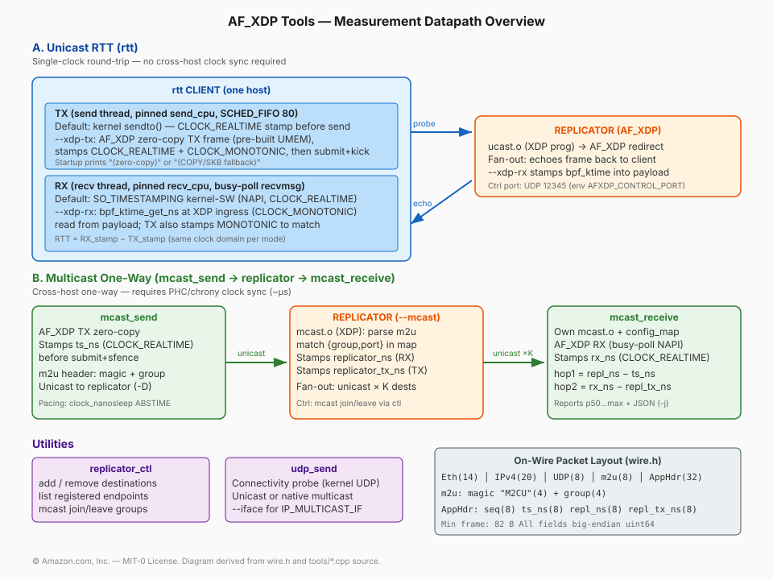
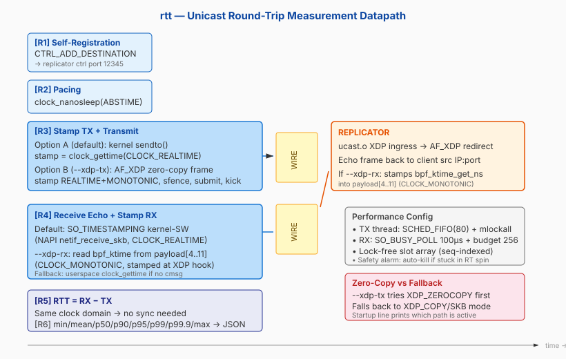
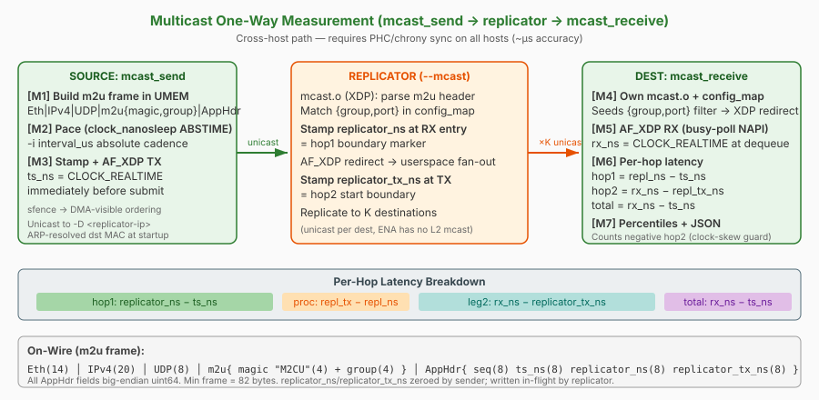

# `tools/` - measurement instruments & control CLI

The instruments that drive and measure the replicator. Two measurement
topologies are supported, each with its own timing methodology:

- **Unicast RTT** (`rtt`) - a **round-trip** probe on a single host's clock →
  no clock sync needed. Sends UDP to the replicator, which echoes it back.
- **Multicast one-way** (`mcast_send` → replicator → `mcast_receive`) - a
  **one-way** fan-out path; timing travels in the payload and both ends read a
  PHC/NTP-disciplined `CLOCK_REALTIME`.

Plus two utilities: `replicator_ctl` (control-protocol CLI) and `udp_send`
(connectivity probe).

---

## Measurement paths (with the tech used at each step)



### A. Unicast RTT (`rtt`) - single-clock round trip



**Steps:**

- **[R1] Self-registration** - `rtt` sends `CTRL_ADD_DESTINATION` to the
  replicator's control port (`AFXDP_CONTROL_PORT`, default 12345) so the echo
  comes back to it. It deregisters (`CTRL_REMOVE_DESTINATION`) via an `atexit`
  handler, which also covers the SIGINT/SIGTERM path (those only clear the run
  flag and return through a normal exit). A `SIGKILL` cannot run `atexit`, so
  the orchestrator additionally issues `purge_dests` to every node in the ucast
  prepare phase as a belt-and-braces cleanup.

  **Why a stale registration is not merely untidy:** in unicast mode the
  replicator fans out each received packet to *every* registered destination,
  with the intended reply sent last in the loop. One leaked registration per
  peer that ever measured against a node therefore adds a constant per-packet
  cost to that node's echo path - which presents as a whole-distribution shift
  (p50 ≈ p90 ≈ p99, tight spread) that grows across consecutive campaigns and
  reaches milliseconds. Always confirm `replicator_ctl <ip> list` is empty
  before trusting a result.
- **[R2] Pacing** - `clock_nanosleep(TIMER_ABSTIME)` fires each send at an
  absolute deadline (target rate), eliminating cumulative drift/jitter that a
  relative `sleep` would accrue.
- **[R3] TX** - the send timestamp is captured *immediately* before the send.
  Two backends:
  - **kernel `sendto()`** (default): simple, but the full kernel TX stack
    (~3–5 µs) is inside the measured leg.
  - **`--xdp-tx[=queue]` + `--iface`** (full builds only): a
    **TX-only AF_XDP socket** opened with `XSK_LIBBPF_FLAGS__INHIBIT_PROG_LOAD`
    (no XDP program - egress is independent of RSS). The whole
    `Eth|IPv4|UDP|payload` frame is built **once into every UMEM frame** at
    startup (dst MAC via ARP); per packet it writes only the 10 ASCII sequence
    digits and stamps TX right before `submit`. Removes the kernel TX stack from
    the measured leg. Binds a **dedicated queue (default 1)** because queue 0 is
    owned by the local `replicator.service`.
    Startup prints **`(zero-copy)`** vs **`(COPY/SKB fallback)`** so the actual
    TX datapath is visible. The bind sequence tries `XDP_ZEROCOPY` first (with
    up to 10 retries to survive prior-XSK teardown races), then falls back to
    `XDP_COPY | XDP_FLAGS_SKB_MODE` if the driver (ENA version-dependent) does
    not support ZC TX.
- **[R3] hot-path perf** - thread pinned to `send_cpu`, `SCHED_FIFO` prio 80,
  `mlockall` (no page faults mid-measurement). Each probe's send time is stored
  in a **lock-free, sequence-indexed slot array** (no map, no mutex).
- **[R4] RX** - two modes:
  - **Default**: kernel software `SO_TIMESTAMPING`
    (`SOF_TIMESTAMPING_RX_SOFTWARE`), recorded in the **NAPI `netif_receive_skb`
    path** (`CLOCK_REALTIME`, before the socket receive-queue → excludes
    socket-queue + scheduler jitter). Falls back to a userspace
    `clock_gettime(CLOCK_REALTIME)` read if no cmsg timestamp.
  - **`--xdp-rx`**: reads a `bpf_ktime_get_ns` (`CLOCK_MONOTONIC`) stamp
    written by `ucast.o` at the XDP ingress hook into the payload bytes
    `[4..11]`; `rtt` then also stamps TX with `CLOCK_MONOTONIC` to match the
    domain. A kernel-SW cmsg stamp is ALSO captured alongside for a dual-stamp
    cross-check reported in the output.
- **[R5]/[R6]** - `RTT = RX − TX` on one host's clock (no sync). Warmup samples
  are discarded, then min/mean/p50/p90/p95/p99/p99.9/max are written as
  `service_rtt_us` alongside `messages, warmup, rate_mps, lost, loss_pct,
  timestamp_rx, timestamp_tx, tx_path`. Exit code 1 if >10% packet loss.

**Loss invalidates percentiles - treat `loss_pct` as a validity flag, not a
footnote.** Every percentile is computed *only* over datagrams that came back.
A run losing X% therefore reports the latency distribution of the surviving
(100−X)%, which is not a random sample: it silently omits exactly the packets
whose fate you care about. Two runs with different loss are not comparable at
all, so a "slower p50" can be pure survivorship bias rather than a real cost.

The orchestrator enforces this with a **loss gate**: `max_loss_pct` (default
2%, `-max-loss` in `afxdpctl`, "Max loss" in the web UI) makes the agent reject
the measurement outright when loss exceeds the threshold. A rejected pair is
recorded as a *failure* - no metrics reach the collector - so the report shows
a blank cell and a coverage note instead of a plausible-looking wrong number.
Set `-1` to disable, which is only appropriate when deliberately characterising
loss itself.

**Why kernel is not slower than AF_XDP at QD=1 (one packet in flight):**

1. AF_XDP's advantage is amortizing per-packet cost across **batches** at high
   PPS. At QD=1 there is nothing to batch.
2. The AF_XDP TX still issues one syscall per packet (the `needs_wakeup` kick);
   the kernel `sendto()` is already a single, fast call.
3. The RX side is identical in every mode (same busy-poll socket, `XDP_PASS`).
4. The "kernel" baseline is NOT the generic stack: `SO_BUSY_POLL` +
   `SO_PREFER_BUSY_POLL` + `SCHED_FIFO` + isolated-core pinning + ENA IRQ
   affinity + `napi_defer_hard_irqs` + `gro_flush_timeout=10us` + coalescing off.

---

### B. Multicast one-way (`mcast_send` → replicator → `mcast_receive`)



**Steps:**

- **[M1] m2u framing** - `mcast_send` builds
  `Eth|IPv4(proto 17)|UDP|m2u{magic "M2CU"=0x4D324355, group}|AppHdr` as a
  **plain unicast** frame to the replicator's private IP (`-D`); the multicast
  group lives only in the m2u tag (ENA has no L2 multicast).
- **[M2] Pacing** - a single `wait_until_ns(t0_ns + (seq+1) * interval_ns)` used
  for **every** interval, on both the AF_XDP and `-k` kernel TX loops. It sleeps
  to an absolute deadline via `clock_nanosleep(CLOCK_MONOTONIC, TIMER_ABSTIME)`.
  A relative sleep or a spin accrues cumulative drift, because each iteration's
  own overhead is added to the gap and the actual interval is always longer than
  requested; a deadline derived from a fixed `t0_ns` self-corrects, so one late
  packet does not push every subsequent packet later. Sleeping rather than
  spinning is also what lets AF_XDP TX completions drain.
- **[M3] Stamp + TX** - `ts_ns = CLOCK_REALTIME` stamped in place just before
  AF_XDP TX submit (zero-copy). `sfence` ensures store-ordering before NIC DMA.
  Dst MAC ARP-resolved at startup.
- **[M4] mcast_receive setup** - attaches its **own** `mcast.o` XDP program and
  seeds `config_map[0] = {group, port}` (`-g`/`-p`) so the NIC redirects
  matching m2u frames to its AF_XDP socket. Non-matching traffic is `XDP_PASS`ed
  to the kernel stack.
- **[M5] AF_XDP RX** - busy-polls the RX ring (`SO_BUSY_POLL`), stamps `rx_ns`
  (`CLOCK_REALTIME`) at dequeue, and reads `ts_ns` / `replicator_ns` /
  `replicator_tx_ns` back out of the payload.
- **[M6]/[M7] Latency breakdown** -
  - **hop1** = `replicator_ns − ts_ns` (source → replicator)
  - **hop2** = `rx_ns − replicator_tx_ns` (replicator → dest)
  - **total** = `rx_ns − ts_ns` (end-to-end)
  - **proc** = `replicator_tx_ns − replicator_ns` (relay processing time)

  Because it's one-way across hosts, both must share a UTC-aligned clock (Nitro
  PHC `/dev/ptp0` + chrony, ~µs). `mcast_receive` counts **negative hop2** /
  **negative total** samples as a live clock-skew diagnostic and reports
  percentiles (p50…max) to stdout and `-j` JSON.

---

## Unicast RTT variations

The `rtt` tool supports four variations that control which transport is used on
the **client side** (sender/receiver). In all cases, the remote replicator echoes
via AF_XDP - so the variation isolates the client's TX/RX path contribution:

| Variation | Client TX | Client RX | Remote echo | What it measures |
|-----------|-----------|-----------|-------------|------------------|
| `kernel` | kernel `sendto()` | kernel `recvfrom()` | AF_XDP | Full kernel socket overhead (both legs) + AF_XDP echo |
| `xdp-tx` | AF_XDP (queue 1) | kernel `recvfrom()` | AF_XDP | XDP-bypassed TX vs kernel RX - isolates TX contribution |
| `xdp-rx` | kernel `sendto()` | AF_XDP | AF_XDP | Kernel TX vs XDP-bypassed RX - isolates RX contribution |
| `xdp-txrx` | AF_XDP TX | AF_XDP RX | AF_XDP | Full XDP bypass both legs - the lowest achievable RTT |

**When to use each:**
- `kernel` - baseline; represents the path a real application using standard sockets would see.
- `xdp-tx` / `xdp-rx` - diagnostic: shows whether TX or RX dominates the kernel overhead.
- `xdp-txrx` - floor; the minimum RTT achievable on this hardware/placement.

---

## Binaries & every launch option

| File | Binary | Build |
|------|--------|-------|
| `rtt.cpp` | `rtt` | full (AF_XDP TX) or echo-mode (`--xdp-tx` rejected) |
| `mcast_send.cpp` | `mcast_send` | full only (`make full`) - needs libxdp |
| `mcast_receive.cpp` | `mcast_receive` | full only (`make full`) - needs libxdp |
| `replicator_ctl.cpp` | `replicator_ctl` | full or echo-mode |
| `udp_send.cpp` | `udp_send` | full or echo-mode |

---

### `rtt` - unicast RTT probe

**Purpose:** Measure round-trip latency through the packet replicator with
minimal measurement overhead. Produces per-run statistics and a JSON summary.

```
rtt <replicator_ip> <replicator_port> <local_ip> <local_port> \
    <total_messages> <rate_per_sec> \
    [warmup=10000] [send_cpu=1] [recv_cpu=2] \
    [--xdp-tx[=queue]] [--iface <name>] [--xdp-rx]
```

| Argument | Type | Description |
|----------|------|-------------|
| `replicator_ip` | positional, required | IP of the replicator data port |
| `replicator_port` | positional, required | UDP port the replicator listens on |
| `local_ip` | positional, required | Local IP to bind the echo receive socket |
| `local_port` | positional, required | Local UDP port for echoes |
| `total_messages` | positional, required | Messages to measure (after warmup) |
| `rate_per_sec` | positional, required | Target send rate (pps) |
| `warmup` | positional, optional | Warmup messages discarded from stats (default: 10000) |
| `send_cpu` | positional, optional | Core pin for the TX thread (default: 1) |
| `recv_cpu` | positional, optional | Core pin for the RX thread (default: 2) |
| `--xdp-tx[=queue]` | flag | Send via TX-only AF_XDP (default queue 1). **Requires `--iface`.** Rejected in echo-mode builds. |
| `--iface <name>` | flag | NIC name for `--xdp-tx` (e.g. `eth0`, `ens5`) |
| `--xdp-rx` | flag | Read the XDP-ingress `bpf_ktime` RX stamp from the payload; switches clock domain to `CLOCK_MONOTONIC` on both TX and RX |

Too few positional args → prints `Usage:` and exits non-zero.

**Output:** JSON written to `/tmp/rtt_results.json` with fields: `client`,
`messages`, `warmup`, `rate_mps`, `lost`, `loss_pct`, `timestamp_rx`,
`timestamp_tx`, `tx_path`, `service_rtt_us{min,mean,p50,p90,p95,p99,p999,max}`,
`response_rtt_us{p50,p99,p999}`.

**Tradeoffs & limitations:**
- At QD=1, `--xdp-tx` achieves parity with kernel sendto (not faster) because
  there is nothing to batch and the RX side is identical.
- The pacing sleep (`clock_nanosleep`) is also the yield point that keeps AF_XDP
  TX completions flowing. Removing it causes TX stalls (not merely higher rate).
- Achievable rate is ~30k pps single-threaded; the tool reports achieved vs
  requested and warns if <80%.
- Safety alarm auto-kills the process if it exceeds `count/rate + 30s` to
  prevent RT spin lockups.

---

### `mcast_send` - m2u multicast source

**Purpose:** Generate a stream of m2u-tunneled multicast packets at a controlled
rate via AF_XDP zero-copy TX, for one-way latency measurement through the
replicator to `mcast_receive`.

```
mcast_send -D <replicator-ip> [options]
```

| Flag | Meaning | Default |
|------|---------|---------|
| `-D <replicator-ip>` | Unicast tunnel destination - **REQUIRED** | - |
| `-I <iface>` | Real NIC interface | `eth0` |
| `-g <group>` | Multicast group (carried in the m2u header only) | `224.0.31.50` |
| `-p <port>` | UDP destination port | `5000` |
| `-c <count>` | Packets to send | `10000` |
| `-i <interval_us>` | Inter-packet gap in µs | `1000` |
| `-s <size>` | Payload size in bytes (min: 32 = `WIRE_APP_HDR_LEN`) | `64` |
| `-q <queue>` | AF_XDP TX queue (avoid queue 0 / RSS); ignored with `-k` | `1` |
| `-k` | Kernel mode: plain UDP socket, no AF_XDP/root (see below) | off |
| `-h` | Print usage and exit 0 | - |

Missing `-D` → `error: -D <replicator-ip> is required` + usage, exit 1.
Unknown option → usage, exit 1.

**Datapath:** TX-only AF_XDP socket with `XSK_LIBBPF_FLAGS__INHIBIT_PROG_LOAD`
(no XDP program). Tries native driver mode first; falls back to SKB mode if the
driver rejects native. All headers are built once per UMEM frame; the hot path
overwrites only `seq` (8B) and `ts_ns` (8B) per packet. Timestamps
`CLOCK_REALTIME` immediately before `xsk_ring_prod__submit` with an `sfence`.

**Pacing:** every interval, sub-ms included, is paced by
`wait_until_ns(t0_ns + (seq+1) * interval_ns)`, which sleeps to an absolute
deadline with `clock_nanosleep(CLOCK_MONOTONIC, TIMER_ABSTIME)`. Both the AF_XDP
and the `-k` kernel TX loop use it. An absolute deadline computed from a fixed
`t0_ns` self-corrects: a relative sleep or spin folds each iteration's own
overhead into the gap, so the realised interval is always longer than requested
and the error compounds, whereas here a late packet does not shift the deadline
of the packets after it. Sleeping instead of spinning also yields the CPU, which
is what allows AF_XDP TX completions to drain.

**Real-time priority:** `enable_realtime()` raises the TX thread to
`SCHED_FIFO` priority 80 and calls `mlockall`. It runs on the **AF_XDP path
only**, and deliberately sits immediately before the hot TX loop rather than
before AF_XDP setup - placing it earlier caused roughly 50% packet loss, because
MAC/ARP resolution and ring setup do blocking work that must not run at RT
priority. If `SCHED_FIFO` cannot be set (no root / `CAP_SYS_NICE`) the tool
warns and continues at `SCHED_OTHER`. The `-k` kernel path stays `SCHED_OTHER`
on purpose so it remains an untuned stock-socket baseline.

**Tradeoffs & limitations:**
- Requires `CAP_NET_ADMIN` / root for AF_XDP.
- The m2u frame is plain **unicast** to the replicator; ENA does not support L2
  multicast, so the group is only meaningful inside the m2u header.
- No built-in RX / statistics - pair with `mcast_receive` on the destination.

**`-k` (kernel mode):** skips AF_XDP entirely - opens a plain
`socket(AF_INET, SOCK_DGRAM, 0)` and `sendto()`s `[m2u(8) | app payload]`
directly; the kernel builds Eth/IP/UDP itself. No root required. This is the
apples-to-apples TX-side counterpart of the replicator's
`REPLICATOR_FWD_MODE=kernel` and `mcast_receive -k` - use all three together
for a full plain-socket baseline run, or mix with AF_XDP `mcast_send`/
`mcast_receive` to isolate which leg of the path benefits from AF_XDP.

---

### `mcast_receive` - AF_XDP multicast sink

**Purpose:** Receive m2u-tunneled multicast frames via AF_XDP, measure one-way
latency with per-hop breakdown, and report percentile statistics.

```
mcast_receive -I <iface> [options]
```

| Flag | Meaning | Default |
|------|---------|---------|
| `-I <iface>` | Network interface - **REQUIRED** | - |
| `-g <group>` | Inner multicast group to match in m2u header | `224.0.31.50` |
| `-p <port>` | Inner UDP destination port to match | `5000` |
| `-c <count>` | Packets to receive before stopping | `10000` |
| `-t <timeout>` | Seconds before giving up (watchdog) | `60` |
| `-q <queue>` | XDP/AF_XDP queue index; ignored with `-k` | `0` |
| `-r` | Print raw latencies (one per line, in ns) | off |
| `-j <path>` | Write JSON results file | - |
| `-k` | Kernel mode: plain UDP socket, no AF_XDP/root/XDP attach; `-I` not required (see below) | off |
| `-h` | Print usage and exit 0 | - |

Missing `-I` → `error: -I <iface> is required` + usage, exit 1 (unless `-k`).

**Datapath:**
1. Loads `mcast.o` (BPF object, search paths: `./src/xdp/mcast.o`,
   `./xdp/mcast.o`, `/opt/af-xdp/xdp/mcast.o`).
2. Attaches to the NIC via XDP (native first, SKB fallback).
3. Seeds `config_map[0]` with `{group, port}` so the XDP filter redirects
   matching m2u frames to the AF_XDP socket.
4. Opens an RX-only AF_XDP socket with `XSK_LIBBPF_FLAGS__INHIBIT_PROG_LOAD`
   (uses the already-attached program).

**`-k` (kernel mode):** skips all four steps above - no `mcast.o`, no XDP
attach, no AF_XDP socket. Binds a plain `AF_INET`/`SOCK_DGRAM` socket to
`-p`'s port and filters by group in userspace (comparing the m2u header's
group field against `-g`, since a kernel socket has no `config_map`-style
kernel-side filter). `recvfrom()`'s buffer already starts at the m2u magic -
the kernel stripped Eth/IP/UDP before userspace ever sees the datagram, so
there is no header-parse step to run before it. Shares the same hop1/hop2/
percentile/`-j` JSON reporting code as the AF_XDP path (`-r`/raw output
included) - only frame acquisition and header-offset math differ.
5. Enables NAPI busy-poll (`SO_BUSY_POLL=50µs`, `SO_PREFER_BUSY_POLL`,
   `SO_BUSY_POLL_BUDGET=64`).
6. Polls RX ring in batches of 64; stamps `rx_ns = CLOCK_REALTIME` at each
   dequeue.
7. **Busy-poll watchdog:** after `WATCHDOG_EMPTY_POLLS = 200000` consecutive
   empty `poll()` calls the RX loop issues a short `nanosleep` and resets the
   counter. Under `SO_BUSY_POLL` a `poll()` calls `sk_busy_loop()` and never
   truly blocks, so a `SCHED_FIFO` 80 thread on an isolated core can spin
   without ever yielding; the `nanosleep` forces a real block and lets
   lower-priority work run. This is defence-in-depth, not the fix for the RT
   bandwidth stall described below (an earlier claim that it improved a 0-of-30
   failure rate was withdrawn as unreliable, since that failure rate is
   time-variable).

**Output:** Per-hop latencies (hop1, hop2, total, proc, leg2), min/mean/p50/p90/
p95/p99/p99.9/max. Counts out-of-order, lost, and negative-hop2 (clock skew)
samples. Optional `-j` JSON output.

**Achieved rate:** the `-j` JSON carries three timing fields. `elapsed_s` is the
receive loop's own wall time, kept for context only. `active_s` spans the first
packet received to the last packet received, and `achieved_pps` is
`(received - 1) / active_s`. Measuring over the active window fixes a real
under-reporting bug: dividing by the loop's elapsed time folded in sender
start-up dead time (measured at 0.10-0.38 s), which produced a phantom
"shortfall" against the requested rate even though the sender's own self-report
was 99.9% the whole time. All modes now measure ~100,000 pps against a 100,000
pps request. `rtt` likewise writes `elapsed_s` and `achieved_pps` into its JSON.

**Tradeoffs & limitations:**
- Requires `CAP_NET_ADMIN` + `CAP_NET_RAW` / root.
- The `rx_ns` stamp is taken in **userspace** at XSK dequeue (not at the XDP
  hook), so it includes ring-poll latency. The replicator's `replicator_tx_ns`
  stamp is the authoritative hop2 start boundary.
- Negative hop values indicate clock skew; ensure all hosts sync to the same
  Nitro PHC (`/dev/ptp0`) via chrony with `refclock PHC` for ≤1 µs accuracy.
- XDP program is detached on exit (SIGINT/SIGTERM/atexit).

#### RT bandwidth throttling on tickless cores

These tools run `SCHED_FIFO` busy-poll threads pinned to `isolcpus` +
`nohz_full` cores. On a tickless core the scheduler tick that normally charges RT
runtime is stopped, so `update_curr_rt()` runs only at sporadic scheduling events
and `rt_time` accumulates in large deferred lumps instead of smoothly. It then
overshoots the default 950 ms / 1000 ms budget, and the kernel throttles the
runqueue to pay the overshoot back - descheduling the busy-poll thread for
hundreds of milliseconds. Measured live: `rt_time` reached 1704 ms against an
`rt_runtime` of 950 ms, `.rt_throttled` flipped to 1 five times in a single
failing run, about 3700 packets were dropped on an affected run, and hop2 showed
a p99 of 73 ms and a max of 93 ms against a normal p50 near 18 µs.

The baked AMI therefore sets `kernel.sched_rt_runtime_us = -1` in
`/etc/sysctl.d/99-rt-sched.conf`, disabling RT bandwidth control entirely. That
is the standard configuration for RT + `nohz_full`, because the accounting is not
reliable on tickless cores. Tightening `sched_rt_period_us` instead was tried and
made things worse - enforcement simply became more frequently lumpy. See
`dev/roadmap/fix.md` for the full investigation.

Accepted tradeoff: this removes the kernel's last-resort protection against a
runaway RT thread. It is mitigated by `isolcpus` keeping these threads off the
CPU0 housekeeping core, by each tool's own idle deadline, and by the agent
wrapping every measurement in `timeout`.

---

### `replicator_ctl` - control-protocol CLI

**Purpose:** Manually manage the replicator's destination table and multicast
group subscriptions from the command line.

```
replicator_ctl <replicator_ip> <command> [args...]
```

| Command | Args | Description |
|---------|------|-------------|
| `add` | `<dest_ip> <dest_port>` | Register destination (`CTRL_ADD_DESTINATION`) |
| `remove` | `<dest_ip> <dest_port>` | Deregister destination (`CTRL_REMOVE_DESTINATION`) |
| `list` | - | List all registered destinations (`CTRL_LIST_DESTINATIONS`) |
| `mcast` | `<group>` | Subscribe to multicast group (`CTRL_MCAST_JOIN`) |
| `mcast-leave` | `<group>` | Unsubscribe from group (`CTRL_MCAST_LEAVE`) |

No command → usage and exit 1.

**Protocol:** Sends a single UDP datagram to the replicator's control port
(default 12345, override via `AFXDP_CONTROL_PORT` env). For `add`/`remove`/
`mcast`/`mcast-leave`, waits up to 5 seconds for a 1-byte ACK (1=success,
0=failure). For `list`, parses a response containing a 1-byte count followed by
6-byte `(ip, port)` entries.

**Notes:**
- `mcast`/`mcast-leave` validate the group is in 224.0.0.0/4 before sending.
- The join is sent **unicast** to `<replicator_ip>`, so it crosses VPC peering
  without native multicast routing.
- No root required (plain UDP socket).

**Use cases:** Debugging destination state, manual fan-out setup, scripted test
orchestration.

---

### `udp_send` - connectivity probe

**Purpose:** Simple keep-alive / connectivity test sender. Useful to verify the
replicator is reachable before running latency measurements, or to exercise
native multicast paths.

```
udp_send <target_ip> <target_port> [interval_ms] [message] [--iface <name>]
```

| Argument | Type | Description | Default |
|----------|------|-------------|---------|
| `target_ip` | positional, required | Destination IP (unicast or multicast 224.x.x.x) | - |
| `target_port` | positional, required | UDP destination port | - |
| `interval_ms` | positional, optional | Milliseconds between packets | `1000` |
| `message` | positional, optional | Payload string | `"Test packet"` |
| `--iface <name>` | flag | Set `IP_MULTICAST_IF` for native multicast | - |

No args → usage and exit 1.

**Behavior:**
- Auto-detects multicast vs unicast from the first octet of `target_ip`.
- For multicast: sets `IP_MULTICAST_TTL=8` and optionally binds to `--iface`
  via `IP_MULTICAST_IF`. TTL=8 crosses TGW/VPC boundaries.
- Sends until Ctrl+C (SIGINT/SIGTERM), printing progress every 10 packets.
- Prints final statistics (count, duration, average rate).

**Tradeoffs & limitations:**
- Plain kernel UDP socket - no AF_XDP, no timestamping. Not a measurement tool.
- For native multicast, `--iface` is **required** to avoid sending on the wrong
  interface. Do NOT use `--iface` with kernel tunnels (it overrides routing).

---

## Timestamping & clocks (summary)

| Path | TX clock | RX clock | Sync needed? |
|------|----------|----------|:---:|
| `rtt` default | `CLOCK_REALTIME` before send | `SO_TIMESTAMPING` SW (NAPI, `CLOCK_REALTIME`) | No (single host round-trip) |
| `rtt --xdp-rx` | `CLOCK_MONOTONIC` | `bpf_ktime_get_ns` at XDP ingress (`CLOCK_MONOTONIC`) | No |
| mcast one-way | `ts_ns` `CLOCK_REALTIME` (source) | `rx_ns` `CLOCK_REALTIME` (dest, XSK dequeue) | **Yes** - PHC/chrony ~µs |

ENA provides **no TX hardware timestamp**; no TSC is used. The replicator's
`replicator_ns`/`replicator_tx_ns` stamps (see `src/Replicator/README.md`) split
the one-way total into source→replicator and replicator→dest hops.

---

## On-wire packet layout (`src/common/wire.h`)

All measurement tools share a single wire-format definition:

**m2u frame (multicast-over-unicast tunnel):**

```
Eth(14) | IPv4(20) | UDP(8) | m2u(8) | AppHeader(32)
         offset 0    off 14   off 34   off 42    off 50
```

- **m2u header** (8 bytes at offset 42): `magic "M2CU" (4B, big-endian 0x4D324355)` + `multicast group (4B, network order)`
- **AppHeader** (32 bytes at offset 50): all fields big-endian `uint64`:

| Offset | Field | Written by |
|--------|-------|-----------|
| 50 | `seq` | sender |
| 58 | `ts_ns` | sender (CLOCK_REALTIME before TX) |
| 66 | `replicator_ns` | replicator at RX entry (0 until stamped) |
| 74 | `replicator_tx_ns` | replicator just before TX submit (0 until stamped) |

Minimum valid m2u frame: **82 bytes** (`WIRE_M2U_MIN_FRAME`).

**rtt --xdp-rx probe header** (inside UDP payload, NOT m2u):

| Offset | Field | Written by |
|--------|-------|-----------|
| 0 | `magic "RTTX" (4B, 0x58545452 little-endian)` | rtt client |
| 4 | `xdp_rx_ns (8B, host order)` | ucast.o at XDP ingress |

---

## Build modes

- **`make full`** builds all five binaries + the AF_XDP `--xdp-tx` backend
  (needs libxdp/libbpf; `mcast_send`/`mcast_receive` are full-only).
- **`make echo-mode`** builds `rtt`, `replicator_ctl`, `udp_send` without
  libxdp; `rtt --xdp-tx` is compiled out (`#ifdef ECHO_MODE_ONLY`) and rejected
  at runtime with `"--xdp-tx not available in this (echo-mode) build"`.

The real AF_XDP datapaths run on EC2 (`deploy/ansible/run_ucast.yaml`,
`run_mcast.yaml`); the container test suite (`tests/`) exercises the CLI/arg
surface and the control protocol against an echo-mode replicator.
